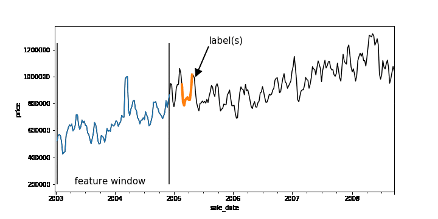

## How to quickly solve machine learning forecasting problems using Pandas and BigQuery

Read more about this solution in the [article](https://cloud.google.com/blog/products/ai-machine-learning/how-to-quickly-solve-machine-learning-forecasting-problems-using-pandas-and-bigquery).

Below is a good workflow for tackling forecasting problems:

1. Create features and labels on a subsample of data using Pandas and train an initial model locally
2. Create features and labels on the full dataset using BigQuery
3. Utilize BigQuery ML to build a scalable machine learning model
4. (Advanced) Build a forecasting model using Recurrent Neural Networks in Keras and TensorFlow

The notebook [`gcp_time_series_forecasting.ipynb`](gcp_time_series_forecasting.ipynb) provides an end-to-end walkthrough of these steps. It is also available on [AI Hub](https://aihub.cloud.google.com/u/0/p/products%2F167a3129-a605-49eb-9f51-c9b32984c0b6/v/1/downloadpage).

The `time_series.py` and `scalable_time_series.py` files show how to create sliding window features and labels using Pandas and BigQuery respectively.

