# Lab Guide
Run this lab from Cloud Shell.  The following instructions assumes you have already run the DM setup and have three Kubernetes Engine clusters installed.  If you have not done so, go to the link below and follow the instructions to get the initial workshop setup.

[Deployment Manager Setup](../dm-setup/README.md)

## Repo
> 1 min

Get all files associated with this workshop by cloning the following repo.  If you have already done this you can skip this step.
```
git clone https://github.com/henrybell/advanced-kubernetes-bootcamp.git
```
## Tools
> 1 min

Run the following bash script to install tools required for this workshop.
```
. ~/advanced-kubernetes-bootcamp/module-2/tools/tools.sh
```
The following tools are installed:
* kubectx/kubens
* Helm
* kube-ps1

## Connect to the Kubernetes Engine Clusters
> 5 mins

You have three (3) Kubernetes Engine clusters in the project.  The suffix for the clusters are `-east`, `-west` and `-spinnaker`.  You use `-east` and `-west` clusters for applications, and the `-spinnaker` cluster for continuous delivery and global load balancing using NGINX load balancer.  

Create `kubeconfig` for all three clusters.
```
export GKE_EAST=$(gcloud container clusters list --zone us-east4-b --format='value(name)')
export GKE_WEST=$(gcloud container clusters list --zone us-west1-c --format='value(name)')
export GKE_SPINNAKER=$(gcloud container clusters list --zone us-west1-b --format='value(name)')
export PROJECT=$(gcloud info --format='value(config.project)')
gcloud container clusters get-credentials $GKE_SPINNAKER --zone us-west1-b --project $PROJECT
gcloud container clusters get-credentials $GKE_EAST --zone us-east4-b --project $PROJECT
gcloud container clusters get-credentials $GKE_WEST --zone us-west1-c --project $PROJECT
```
Rename cluster contexts for easy switching.
```
kubectx gke-spinnaker="gke_"$PROJECT"_us-west1-b_"$GKE_SPINNAKER
kubectx gke-east="gke_"$PROJECT"_us-east4-b_"$GKE_EAST
kubectx gke-west="gke_"$PROJECT"_us-west1-c_"$GKE_WEST
```
Check new context names
```
kubectx
```
_Output_
```
gke-east
gke-spinnaker
gke-west
```
Current context is highlighted.
## Istio on gke-west and gke-east
> 5 mins

Later in the lab, you use Istio for traffic management.  Ensure Istio is installed on `gke-west` and `gke-east` clusters.
```
kubectl get deploy -n istio-system --context gke-west
kubectl get deploy -n istio-system --context gke-east
```
_Output_
```
NAME                       DESIRED   CURRENT   UP-TO-DATE   AVAILABLE   AGE
istio-citadel              1         1         1            1           44m
istio-ingress              1         1         1            1           44m
istio-pilot                1         1         1            1           44m
istio-policy               1         1         1            1           44m
istio-sidecar-injector     1         1         1            1           44m
istio-statsd-prom-bridge   1         1         1            1           44m
istio-telemetry            1         1         1            1           44m
```
Confirm _ISTIO-INJECTION_ is enabled on both `gke-west` and `gke-east`
```
kubectl get namespace -L istio-injection --context gke-west
kubectl get namespace -L istio-injection --context gke-east
```
_Output excerpt_
```
NAME           STATUS    AGE       ISTIO-INJECTION
default        Active    7m        enabled
istio-system   Active    3m
kube-public    Active    7m
kube-system    Active    7m
```

## Spinnaker on gke-spinnaker
> 20 mins

You can use Spinnaker to continuously deploy applications to Kubernetes Engine clusters.  In this workshop, you use `gke-spinnaker` cluster, which has Spinnaker installed, to deploy applications on `gke-west` and `gke-east` clusters.  Ensure Spinnaker and all of its components are installed on `gke-spinnaker`.
```
kubectx gke-spinnaker
kubectl get deployments
```
_Output_
```
NAME                           DESIRED   CURRENT   UP-TO-DATE   AVAILABLE   AGE
mc-taw-jenkins                 1         1         1            1           1h
mc-taw-redis                   1         1         1            1           1h
mc-taw-spinnaker-clouddriver   1         1         1            1           1h
mc-taw-spinnaker-deck          1         1         1            1           1h
mc-taw-spinnaker-echo          1         1         1            1           1h
mc-taw-spinnaker-front50       1         1         1            1           1h
mc-taw-spinnaker-gate          1         1         1            1           1h
mc-taw-spinnaker-igor          1         1         1            1           1h
mc-taw-spinnaker-orca          1         1         1            1           1h
mc-taw-spinnaker-rosco         1         1         1            1           1h
```
Expose the `DECK` (Spinnaker frontend) pod.
```
export DECK_POD=$(kubectl get pods --namespace default -l "component=deck" -o jsonpath="{.items[0].metadata.name}") 
kubectl port-forward --namespace default $DECK_POD 8080:9000 >> /dev/null &
```
Access the Spinnaker GUI using the Cloud Shell Preview

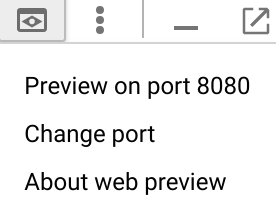 

You get the Spinnaker GUI with the header as shown below


Create an app in Spinnaker named `myapp` by clicking on **Action** and **Create App**.

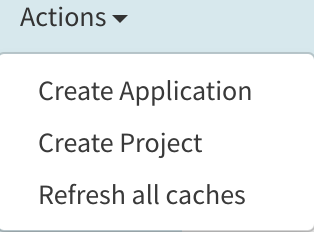

Only provide app name `myapp` and email which can be arbitrary like `abc@xyz.com`.  Leave everything else blank or default.
> Application must be named `myapp` 

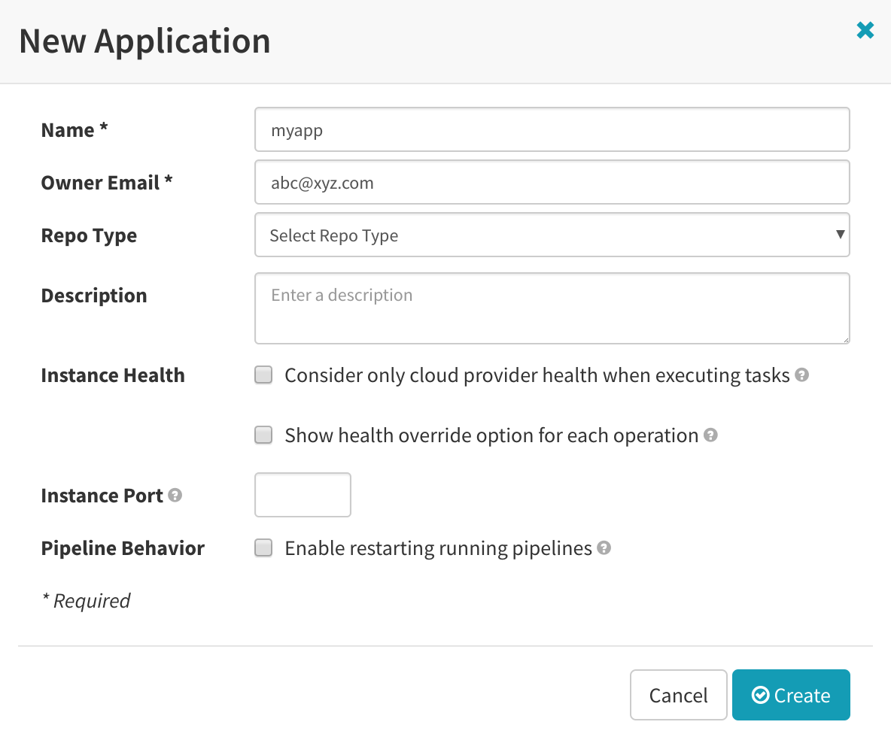

To avoid having to enter the information manually in the UI, use the Kubernetes command-line interface to create load balancers (or `Clusters`) and Ingresses (or `Security Groups`) for your services. Alternatively, you can perform this operation in the Spinnaker UI.
```
kubectx gke-west
kubectl apply -f ~/advanced-kubernetes-bootcamp/module-2/gke-west
kubectx gke-east
kubectl apply -f ~/advanced-kubernetes-bootcamp/module-2/gke-east
```
## Prepare Container Registry
> 5 mins

For this workshop, you use a simple webserver to simulate an application.  You can use hightowerlabs `webserver` (which takes an `arg` for index.html explained a bit later in the workshop).  Also, use `busyboxplus` to simulate canary testing during the pipeline deployment.
```
gcloud docker -- pull gcr.io/hightowerlabs/server:0.0.1
gcloud docker -- pull radial/busyboxplus
```
Define vars with image IDs for the two images
```
export WEB_IMAGE_ID=$(docker images gcr.io/hightowerlabs/server --format "{{.ID}}")
export BUSYBOX_IMAGE_ID=$(docker images radial/busyboxplus --format "{{.ID}}")
export PROJECT=$(gcloud info --format='value(config.project)')
```
Tag and push both images to Container Registry
```
docker tag $WEB_IMAGE_ID gcr.io/$PROJECT/web-server:v1.0.0
gcloud docker -- push gcr.io/$PROJECT/web-server:v1.0.0
docker tag $BUSYBOX_IMAGE_ID gcr.io/$PROJECT/busyboxplus
gcloud docker -- push gcr.io/$PROJECT/busyboxplus
```
Confirm both images are present in Container Registry
```
gcloud container images list
```
_Output_
```
NAME
gcr.io/qwiklabs-gcp-28ba43f03d974ba6/busyboxplus
gcr.io/qwiklabs-gcp-28ba43f03d974ba6/web-server
```
## Manually deploying Spinnaker pipelines
> 15 mins

Deploy pipeline via JSON
```
cd ~/advanced-kubernetes-bootcamp/module-2/spinnaker
export ZONE_WEST=us-west1-c
export ZONE_EAST=us-east4-b
sed -e s/PROJECT/$PROJECT/g -e s/ZONE_WEST/$ZONE_WEST/g -e s/ZONE_EAST/$ZONE_EAST/g -e s/GKE_WEST/$GKE_WEST/g -e s/GKE_EAST/$GKE_EAST/g pipeline.json | curl -d@- -X \
    POST --header "Content-Type: application/json" --header \
    "Accept: /" http://localhost:8080/gate/pipelines
```
Click on **Pipeline** and click **Configure > Deploy** to inspect it.

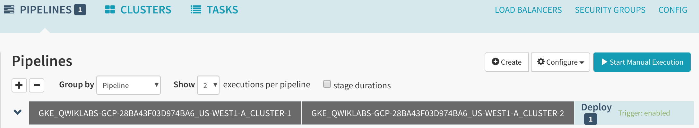

Details of **Deploy** pipeline below.

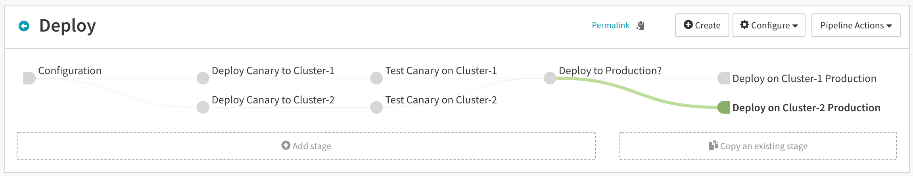

The `Deploy` pipeline deploys canary to both clusters (`cluster-1` and `cluster-2`), it then tests the canaries.  There is a `manual judgement` stage prompting a user to proceed.  After the user hits continue, application is deployed to both clusters in production.

Click on individual stages in the `Deploy` pipeline to inspect them in detail.

* In `Configuration` stage, you use `version tag` to trigger the pipeline.  Every time the version tag is changed on the image, the pipeline is automatically triggered.
* `Deploy` stages are Kubernetes Deployments, with Services and Ingresses created in the previous section..
* For `Test` stages, you do a simple `curl` to the `myapp` web application and ensure liveness.
* `Deploy to Production?` is a manual judgement stage prompting a human if its allowed to proceed.
* After the manual judgement stage, `myapp` is deployed to production.

Run the pipeline manually from the GUI.  Clink on **Pipeline** link, and then the **Start Manual Execution** button.  Select the **Deploy** pipeline from the dropdown and version tag **v1.0.0**.  

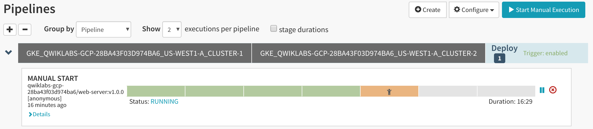

Each rectangle represents a stage in the pipeline.  Click on various stages to get more details on steps being performed.

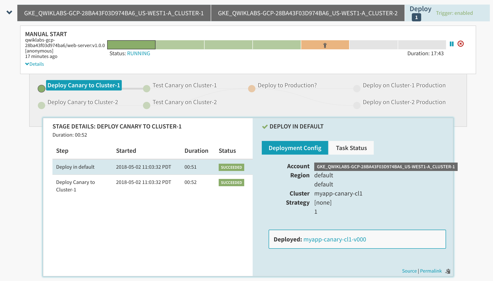

Once at the manual judgement stage, pause!

**DO NOT HIT CONTINUE YET!**

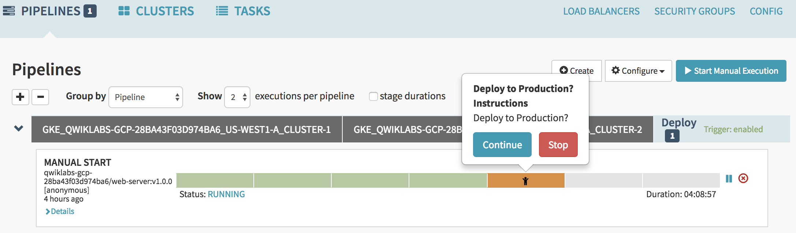

Click on **Clusters** to see `v1.0.0` pods deployed as canaries to both clusters.

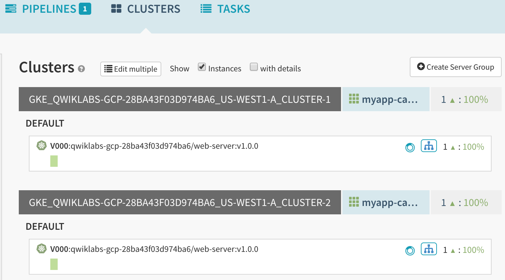

You see one (1) pod (represented as a single rectangle) deployed in both clusters.  Green color represents healthy status.  You can also confirm this in the clusters using `kubectl` commands.

Ensure both pods are exposed via Istio ingress in each cluster.

Click on **Security Groups**.  If none show up refresh the browser.  
Click on the application in both clusters and then **Status** dropdown from the right hand details box.

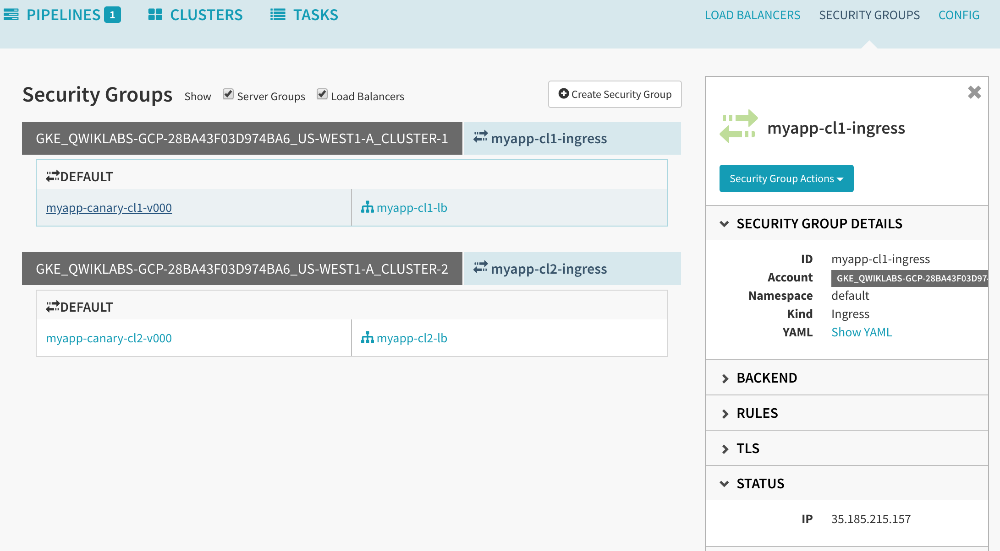

You see the ingress IP address for both cluster.

Curl both IPs to see the environment (canary or prod) and version of the application.  For example.
```
curl 35.185.215.157
```
_Output_
```
myapp-canary-gke-west-v1.0.0
```
The output of `curl` has the form _appName-environment-cluster-version_.  The above output shows `myapp` application running as `canary` on `gke-west` and the version is `v1.0.0`.  This is helpful when you have multiple versions running in multiple environments on multiple clusters.  This is done using an `arg` in the deployment YAML that is pushed to the index.html file.  (You can inspect this in the `Deploy` stages in the pipeline)

## Globally load balance client traffic to gke-west and gke-east clusters
> 10 mins

For this workshop, you use NGINX load balancer to direct traffic to the web application running in both clusters.  In production environments, you can use a third party provider for this service.  CloudFlare, Akamai or backplane.io all provide this functionality.  

Store the Ingress IP addresses for the two clusters in variables
```
export GKE_WEST_INGRESS_IP=$(kubectl get ingress myapp-gke-west-ingress -o jsonpath='{.status.loadBalancer.ingress[0].ip}' --context gke-west)
export GKE_EAST_INGRESS_IP=$(kubectl get ingress myapp-gke-east-ingress -o jsonpath='{.status.loadBalancer.ingress[0].ip}' --context gke-east)
```
Use `gke-spinnaker` for global load balancing.  Create the NGINX ConfigMap in `gke-spinnaker`
```
kubectx gke-spinnaker
cd ~/advanced-kubernetes-bootcamp/module-2/lb
sed -e s/CLUSTER1_INGRESS_IP/$GKE_WEST_INGRESS_IP\ weight=1/g -e s/CLUSTER2_INGRESS_IP/$GKE_EAST_INGRESS_IP\ weight=1/g glb-configmap-var.yaml > glb-configmap.yaml
```
Confirm that the Ingress IP addresses are in the output file.
```
cat glb-configmap.yaml
```
Apply the configmap
```
kubectl apply -f glb-configmap.yaml
```
Create the NGINX deployment and service
```
kubectl apply -f nginx-dep.yaml
kubectl apply -f nginx-svc.yaml
```
Ensure that the `global-lb-nginx` Service has a public IP address.  You can run the following commands a few times or watch it using the `-w` option in the command line.
```
kubectl get service global-lb-nginx
```
Once you have the public IP address, store it in a variable and do a for loop curl.
```
export GLB_IP=$(kubectl get service global-lb-nginx -o jsonpath='{.status.loadBalancer.ingress[0].ip}')
for i in `seq 1 20`; do curl $GLB_IP; done
```
Traffic to the two (2) canary pods is being split 50/50.  This ratio can be controlled by the `weight` field in the ConfigMap  generated earlier.  Recall that you set the `weight` fields for both clusters to `1`.

Adjust the `weight` fields in the ConfigMap by changing the `weight` for `gke-east` to `4`.  Set the `weight` for `gke-west` to `1` (same as before).  Apply the new configmap and deployment.
```
sed -e s/CLUSTER1_INGRESS_IP/$GKE_WEST_INGRESS_IP\ weight=1/g -e s/CLUSTER2_INGRESS_IP/$GKE_EAST_INGRESS_IP\ weight=4/g glb-configmap-var.yaml > glb-configmap-2.yaml
kubectl delete -f glb-configmap.yaml
kubectl delete -f nginx-dep.yaml
kubectl apply -f glb-configmap-2.yaml
kubectl apply -f nginx-dep.yaml
```
Do a for loop curl on the `GLB_IP` and you can see more traffic going to `gke-east` due to higher `weight` (4 versus 1).
```
for i in `seq 1 20`; do curl $GLB_IP; done
```
## Triggering application updates in Spinnaker
> 15 mins

Return to the Spinnaker GUI and finish deploying the pipeline.

Click on **Pipelines** and click **Continue** on the `manual judgement` phase.


After the pipeline completes, click on **Clusters**.  In addition to the single canary pod, you can see four (4) pods of `v1.0.0` running in production in both clusters.

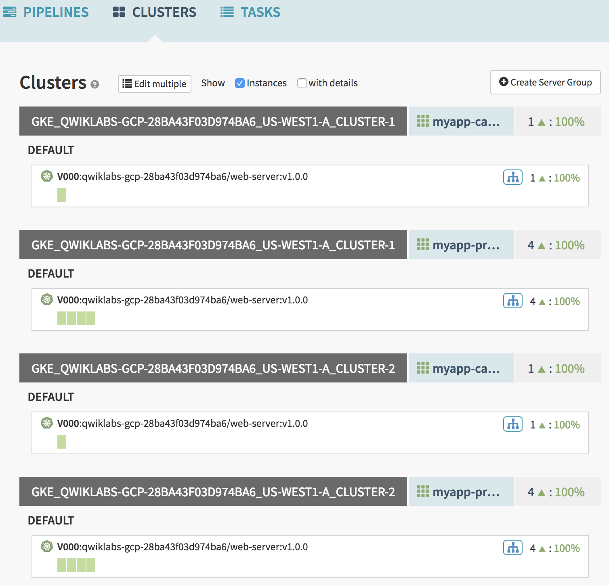

You can now update the application by updating the version number from `v1.0.0` to `v1.0.1` in Container Registry.  This simulates application update and triggers the `Deploy` pipeline.
```
gcloud docker -- pull gcr.io/$PROJECT/web-server:v1.0.0
MYAPP_IMAGE_ID=$(docker images gcr.io/$PROJECT/web-server --format "{{.ID}}")
docker tag $MYAPP_IMAGE_ID gcr.io/$PROJECT/web-server:v1.0.1
gcloud docker -- push gcr.io/$PROJECT/web-server:v1.0.1
```
Click on **Pipelines** and refresh the page (if needed).  You see the pipeline being triggered.

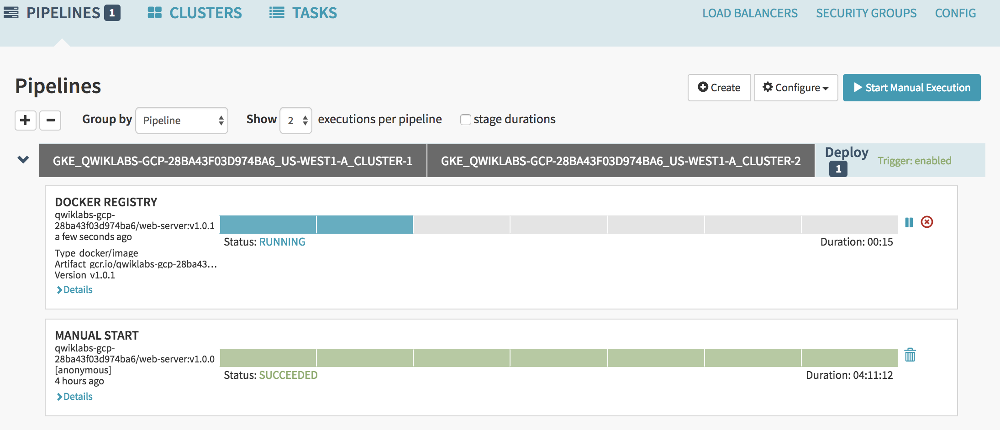

**STOP** at the manual judgement stage.

**DO NOT HIT CONTINUE YET!**

Click on **Clusters**.  You can see one canary pod of `v1.0.1` and four production pods of `v1.0.0` running in both clusters.

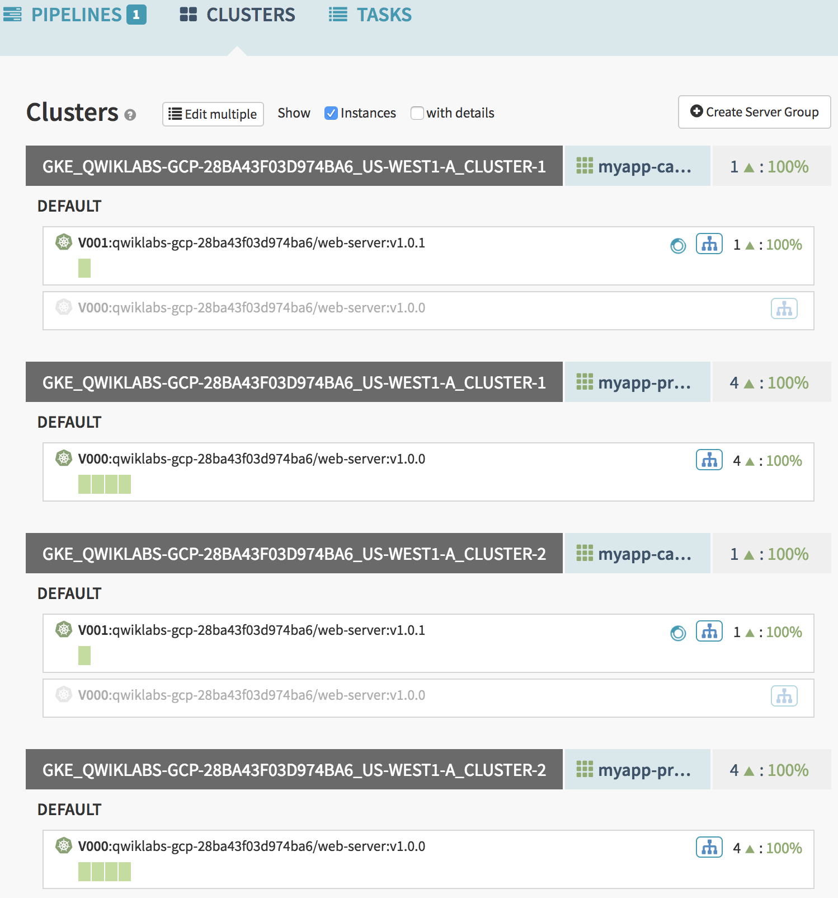

## Traffic Management with Istio
> 15 mins

By default, traffic gets evenly split to all pods within a service.  The service has five (5) pods total.  One (1) pod is running the newer canary version `v1.0.1` and four (4) pods are running the production version `v1.0.0`.

Do a for loop curl on Ingress IP addresses for cluster-1 and cluster-2.
```
for i in `seq 1 20`; do curl $GKE_WEST_INGRESS_IP; done
for i in `seq 1 20`; do curl $GKE_EAST_INGRESS_IP; done
```
You can see about about 20% of the traffic going to `v1.0.1` (canary) and 80% to production `v1.0.0`.  We can use Istio to manipulate traffic inside the cluster.
We can use:
* `RouteRules` to direct traffic to different versions of the service.
* Rate Limit based on number of connections

### Controlling traffic to production and canary releases

Lets send 100% of the traffic to `prod` pods in `gke-west`.  Istio uses `RouteRules` based on a match criteria and `weights` to route traffic to multiple deployments under one service.  Match criteria can be based on `labels` like `"stack": "canary"` or `"stack": "prod"`, or it can be based on HTTP Header info (for example, specific users or type of browsers etc).  For this workshop, you use `labels` to match traffic for `canary` and `prod` and `weights` to determine how much traffic to send for each deployment.
```
cd ~/advanced-kubernetes-bootcamp/module-2/lb
kubectx gke-west
kubectl apply -f myapp-rr-100p.yaml
```
Inspect the `RouteRule`
```
kubectl describe routerules
```
_Output excerpt_
```
Spec:
  Destination:
    Domain:  svc.cluster.local
    Name:    myapp-gke-west-lb
  Route:
    Labels:
      Stack:  prod
    Weight:   100
```
We see 100% of the traffic going to `prod` pods, labeled as `"Stack": "prod"`
Confirm RouteRule.
```
for i in `seq 1 10`; do curl $GKE_WEST_INGRESS_IP; done
```
_Output_
```
myapp-prod-gke-west-v1.0.0
myapp-prod-gke-west-v1.0.0
myapp-prod-gke-west-v1.0.0
myapp-prod-gke-west-v1.0.0
myapp-prod-gke-west-v1.0.0
myapp-prod-gke-west-v1.0.0
myapp-prod-gke-west-v1.0.0
myapp-prod-gke-west-v1.0.0
myapp-prod-gke-west-v1.0.0
myapp-prod-gke-west-v1.0.0
myapp-prod-gke-west-v1.0.0
```
Now send 100% of the traffic to the `canary` pod.
```
kubectl delete -f myapp-rr-100p.yaml
kubectl apply -f myapp-rr-100c.yaml
```
Describe RouteRule.
```
kubectl describe routerules
```
_Output excerpt_
```
Spec:
  Destination:
    Domain:  svc.cluster.local
    Name:    myapp-gke-west-lb
  Route:
    Labels:
      Stack:  canary
    Weight:   100
```
And confirm.
```
for i in `seq 1 10`; do curl $GKE_WEST_INGRESS_IP; done
```
_Output_
```
myapp-canary-gke-west-v1.0.1
myapp-canary-gke-west-v1.0.1
myapp-canary-gke-west-v1.0.1
myapp-canary-gke-west-v1.0.1
myapp-canary-gke-west-v1.0.1
myapp-canary-gke-west-v1.0.1
myapp-canary-gke-west-v1.0.1
myapp-canary-gke-west-v1.0.1
myapp-canary-gke-west-v1.0.1
myapp-canary-gke-west-v1.0.1
```
Lastly, lets send 95% of the traffic to `prod` and only 5% of the traffic to `canary`.
```
kubectl delete -f myapp-rr-100c.yaml
kubectl apply -f myapp-rr-95p-5c.yaml
```
Describe RouteRule.
```
kubectl describe routerules
```
_Output excerpt_
```
Spec:
  Destination:
    Domain:  svc.cluster.local
    Name:    myapp-gke-west-lb
  Route:
    Labels:
      Stack:  prod
    Weight:   95
    Labels:
      Stack:  canary
    Weight:   5
```
And confirm.
```
for i in `seq 1 50`; do curl $GKE_WEST_INGRESS_IP; done
```
You see only one or two requests hitting the `canary` pod, the rest are going to the `prod` pods.

### Rate Limiting traffic to myapp service

In Istio, Mixer is responsible for policy enforcement.  One of the policies is the ability to rate limit traffic to Kubernetes services.  Mixer applies and enforces these policies.
Run a simple HTTP benchmark using the hey utility to get baseline performance in requests/secs.
Install `hey`
```
go get -u github.com/rakyll/hey
```
Run a simple benchmark without Rate Limiting applied.  Use `cluster-1` for this example.  The following command runs the benchmark for 10 seconds (type `hey` to get a description of defaults).
```
hey -z 10s http://$GKE_WEST_INGRESS_IP
```
_Output excerpt_
```
Summary:
  Total:        10.1821 secs
  Slowest:      1.1752 secs
  Fastest:      0.0017 secs
  Average:      0.0525 secs
  Requests/sec: 952.2630

…

Status code distribution:
  [200] 9696 responses
```
Note the `Requests/sec` in the `Summary` section as well as the `Status code distribution`.  You are only receiving `Status 200` from the myapp service.
Apply a Mixer Rate Limit rule to `cluster-1` and set the rate limit to 100 Requests/sec.
```
cd ~/advanced-kubernetes-bootcamp/module-2/lb
kubectx gke-west
kubectl apply -f rl100.yaml
```
Describe the `memquotas`.
```
kubectl describe memquotas
```
_Output excerpt_
```
Quotas:
    Max Amount:  100
    Name:        requestcount.quota.default
    Overrides:
      Dimensions:
        Destination:   myapp-gke-west-lb
      Max Amount:      1
      Valid Duration:  1s
    Valid Duration:    1s
```
Note the `Max amount` of `100` with a `Valid Duration` of `1` second.
Run the benchmark again.
```
hey -z 10s http://$GKE_WEST_INGRESS_IP
```
_Output excerpt_
```
Summary:
  Total:        10.2650 secs
  Slowest:      1.2749 secs
  Fastest:      0.0010 secs
  Average:      0.0470 secs
  Requests/sec: 1063.2282

…

Status code distribution:
  [200] 814 responses
  [429] 10100 responses
```
The output of hey benchmark shows `Requests/sec` for the total number of responses.
You can see two Status codes under `Status code distribution`. HTTP Status code `429` stands for `Too Many Requests` given the amount of time.   You can calculate the correct Requests/seconds by dividing the number of `OK` responses (represented by HTTP Status 200) by the amount of time the test was ran.  In this example, the test ran for 10 seconds with 814 [200] responses.  This results in the Requests/second of **81.4** which is close to the rate limit we set.
