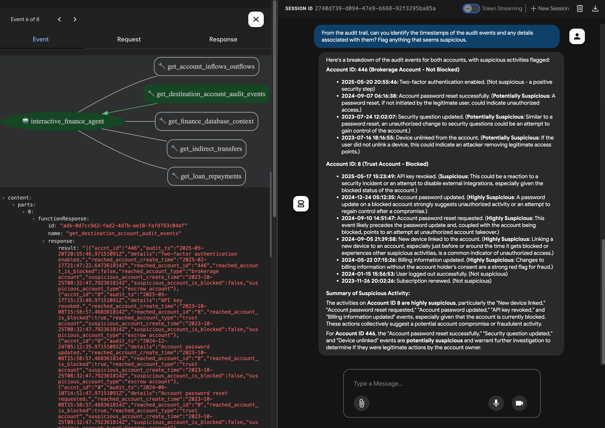

# Build an Enterprise-ready AI Agent with Agent Development Kit (ADK) and MCP Toolbox for Databases
Author: Paul Ramsey - Customer Engineer, Data Management, Google Cloud

## Introduction

This hands-on lab guides you through building and deploying a sophisticated, secure AI agent capable of interacting with sensitive financial data in an enterprise environment. You'll gain hands-on experience with Google's Agent Development Kit (ADK) and MCP Toolbox for Databases, learning how to create and customize powerful tools for your agent. More importantly, you'll master the critical security principles and services necessary for enterprise-grade AI, including the configuration of private networks (VPC, PSC, PSA, GPA) and the implementation of robust access controls with Identity-Aware Proxy (IAP). By completing the lab, you will be equipped with the knowledge to build and deploy your own secure, interactive, and autonomous agents that can safely connect to and reason about sensitive data in a real-world enterprise setting.



## What You'll Need

* A Google Cloud Account.
* Permissions to create a project and Google Cloud resources.

## Core Infrastructure Provisioning with Terraform

The [Terraform template](./terraform/main.tf) in this repository is designed to provision all the necessary core infrastructure for this lab. This ensures a consistent and reproducible environment. The template will create the following resources in your Google Cloud project:

* Networking: A custom Virtual Private Cloud (VPC) will be created to provide a secure and isolated network environment. This includes:
    * A Cloud Router and Cloud NAT Gateway to allow resources within the VPC to securely access the internet.
    * Firewall rules to control traffic flow and enhance security.
    * A private IP range for service networking, enabling private communication with Google Cloud services.
* Databases:
    * An AlloyDB cluster and instance, a fully-managed, PostgreSQL-compatible database service for demanding transactional and analytical workloads.
    * A Spanner instance and database, a globally-distributed, strongly consistent database service. The schema and initial data for the Spanner database will also be created.
* AI and Compute:
    * A Vertex AI Workbench instance, a managed Jupyter notebook environment where you will run the provided notebooks to complete the lab.
* APIs: All necessary APIs will be enabled, including those for Spanner, AlloyDB, and other related services.

## Setup

1. Create a new Google Cloud project.

1. Install [Terraform](https://developer.hashicorp.com/terraform/tutorials/aws-get-started/install-cli) the [Google Cloud SDK](https://cloud.google.com/sdk/docs/install)

1. Clone this repository:

    ``` bash
    git clone https://github.com/paulramsey/adk-toolbox-agent.git
    cd adk-toolbox-agent
    ```

1. Obtain authentication credentials.

    Create local credentials by running the following:

    ``` bash
    gcloud auth login
    gcloud auth application-default login
    ```

    Read more about [Google Cloud Platform Authentication](https://cloud.google.com/docs/authentication).

1. Set your project context by running the following:

    > IMPORTANT: Replace YOUR_PROJECT_ID with the id of your GCP project before running the command below.

    ``` bash
    gcloud config set project YOUR_PROJECT_ID
    gcloud auth application-default set-quota-project YOUR_PROJECT_ID
    ```

1. Define environment variables. 
    > IMPORTANT: Replace the values for YOUR_PROJECT, YOUR_REGION, YOUR_ALLOYDB_ PASSWORD, and YOUR_CSQL_PASSWORD in the command below before running it.

    > IMPORTANT: The passwords you choose for AlloyDB and Cloud SQL must conform to the following minimum complexity requirements: 
        "password.min_uppercase_letters"             = "1"
        "password.min_numerical_chars"               = "1"
        "password.min_pass_length"                   = "10"

    > IMPORTANT: Take note of the AlloyDB and Cloud SQL passwords you define here, as you will need them throughout the lab.

    ``` bash
    export TF_VAR_gcp_project_id="YOUR_PROJECT"
    export TF_VAR_region="YOUR_REGION"
    export TF_VAR_alloydb_password="YOUR_ALLOYDB_ PASSWORD"
    export TF_VAR_cloud_sql_password="YOUR_CSQL_PASSWORD"
    ```

1. Deploy base infrastructure with Terraform.

    ``` bash
    # Initialize terraform
    cd terraform/
    terraform init
    ```

    ``` bash
    # View resource creation plan
    terraform plan
    ```

    ``` bash
    # Apply the terraform template
    terraform apply
    ```

1. Copy the value of the `workbench_proxy_uri` Terraform output (last line of output) and paste it into a browser to access the Vertex AI Workbench environment where you will complete the labs.

1. Walk through the following notebooks, which will be loaded into the Workbench environment for you automatically into the Vertex AI Workbench instance by Terraform (in the `./notebooks` directory):

    - [1_setup_and_explore_databases.ipynb](./notebooks/1_setup_and_explore_databases.ipynb): This notebook is the first step in the lab, designed to finalize the setup of the database environment and to familiarize you with the database schemas and data. The core infrastructure, including an AlloyDB cluster and a Spanner instance, is already provisioned via Terraform. The notebook will guide you through the final setup steps for these databases and allow you to explore their structure and content.
    - [2_deploy_mcp_toolbox.ipynb](./notebooks/2_deploy_mcp_toolbox.ipynb): MCP Toolbox for Databases is an open source MCP server that enables you to develop Database tools for agents easier, faster, and more securely by handling the complexities such as connection pooling, authentication, and more. This notebook walks you through creating two simple MCP Toolbox tools and deploying them onto a Toolbox service in Cloud Run.
    - [3_build_adk_agent.ipynb](./notebooks/3_build_adk_agent.ipynb): Agent Development Kit (ADK) is a flexible and modular framework for developing and deploying AI agents. ADK was designed to make agent development feel more like software development, to make it easier for developers to create, deploy, and orchestrate agentic architectures that range from simple tasks to complex workflows. This notebook walks you through building your first ADK Agent and connecting it to the tools you deployed to MCP Toolbox. You will also integrate the ADK Session service with Cloud SQL for PostgreSQL to persist this critical context.
  

## Clean-up

When you are done with lab, tear down the deployed infrastructure to avoid incurring ongoing charges for provisioned resources.

Options:

1. If you created a new, dedicated Google Cloud project to run this lab as recommended in the setup instructions, you can delete the whole project to remove all created resources.

    > IMPORTANT: Be sure to set PROJECT_ID to the correct project, and run this command ONLY if you are sure there is nothing in the project that you might still need. This command will permanently destroy everything in the project.

    ``` bash
    # Set your project id
    PROJECT_ID='YOUR PROJECT ID HERE'
    gcloud projects delete ${PROJECT_ID}
    ```

1. If you deployed resources into a shared project, you can use Terraform to tear down the core infrastructure resources created during setup.

    > NOTE: If using this option, you will need to manually delete the resources created when executing the notebooks to avoid incurring charges for those services.

    ``` bash
    terraform destroy 
    ```


## License

Please refer to the LICENSE file for details.

## Disclaimers

1. This project is intended for informational and educational purposes only. It is not a production-ready solution and should not be used in a live environment without further development and security hardening.
1. This software is provided "as is", without warranty of any kind, expressed or implied, including but not limited to, the warranties of merchantability, fitness for a particular purpose, and/or infringement. See LICENSE file for additional details.