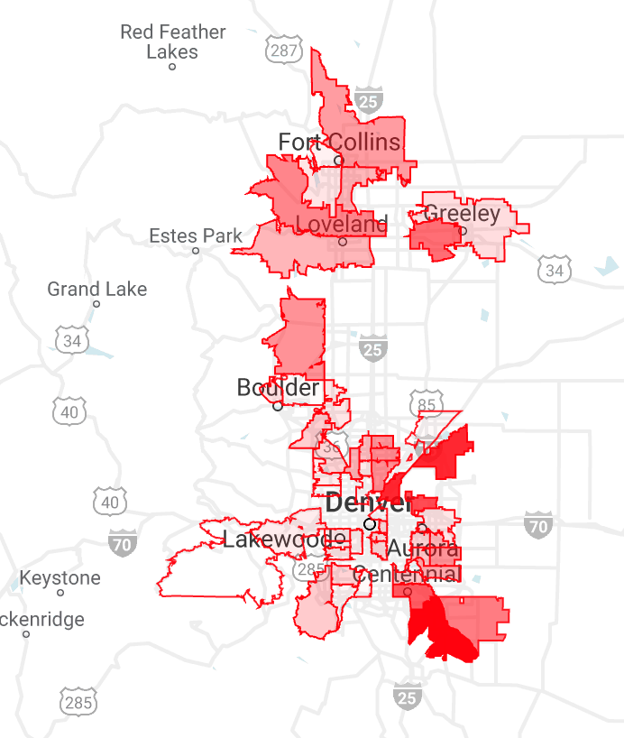

# BigQuery GeoViz

Many of the [BigQuery public datasets](https://cloud.google.com/bigquery/public-data/) contain geographical data. In this demo, we'll plot US ZIP code boundaries and color them based on population growth between the 2000 and 2010 census.

First, run the following in BigQuery. The query joins two tables in the census dataset to obtain the fastest-growing ZIP codes between the 2000 and 2010 census and the geographical boundaries of each ZIP code area. Feel free to modify the WHERE clause for your state. Don't worry about cost: the query ingests 160MB, which costs less than 1/10 of a cent.

```sql
#standardSQL
SELECT
  zipcode,
  z.city,
  z.state_name,
  pop_2000,
  pop_2010,
  pop_chg,
  pop_pct_chg,
  ST_GEOGFROMTEXT(z.zipcode_geom) as geog
FROM (
  SELECT
    r1.zipcode AS rzipcode,
    r2.population AS pop_2000,
    r1.population AS pop_2010,
    r1.population - r2.population AS pop_chg,
    ROUND((r1.population - r2.population)/NULLIF(r2.population,0) * 100, 2) AS pop_pct_chg,
    ABS((r1.population - r2.population)/NULLIF(r2.population,0)) AS abs_pct_chg
  FROM 
    `bigquery-public-data.census_bureau_usa.population_by_zip_2010` AS r1
  INNER JOIN
    `bigquery-public-data.census_bureau_usa.population_by_zip_2000` AS r2
  ON
    r1.zipcode = r2.zipcode 
    WHERE r1.population > 10000
      AND r2.population > 10000
)
INNER JOIN `bigquery-public-data.utility_us.zipcode_area` z
  ON rzipcode = z.zipcode
WHERE z.state_name = "Colorado"
  AND pop_pct_chg > 100
ORDER BY
  abs_pct_chg DESC
```

Note the use of the ST_GEOGFROMTEXT function in the query and the *geog* column in the output containing the boundaries of each ZIP code area in [Well-Known Text](https://en.wikipedia.org/wiki/Well-known_text_representation_of_geometry) format. Let's use BigQuery GeoViz to create a map of these areas. Paste the query into [BigQuery GeoViz](bigquerygeoviz.appspot.com). Authorize the tool to connect using your GCP credentials and select any project. Paste in the query above and click Run.

Now let's make the map data-driven. On the left side, click on *Style* (near the bottom) and expand the section for *Fill opacity*. Click the *Data-driven* toggle to turn it on. Select the _Linear_ interpolation function and choose _pop_pct_chg_ as the field. For the *Domain* fields, enter 100 as the minimum and enter maximum based on the value shown from your data. In the *Range* fields, enter 0 and 1, respectively. These parameters will cause the map to show transparent fill for areas with the minimum growth (1x) and the darkest fill for areas with the fastest percent change between 2000 and 2010. Your final map will look something like this (for the Colorado Front Range):

