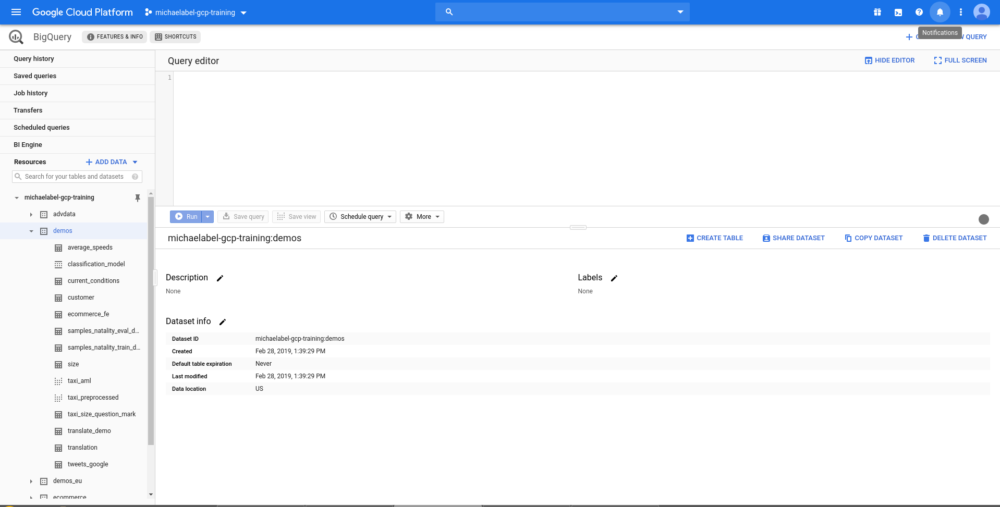
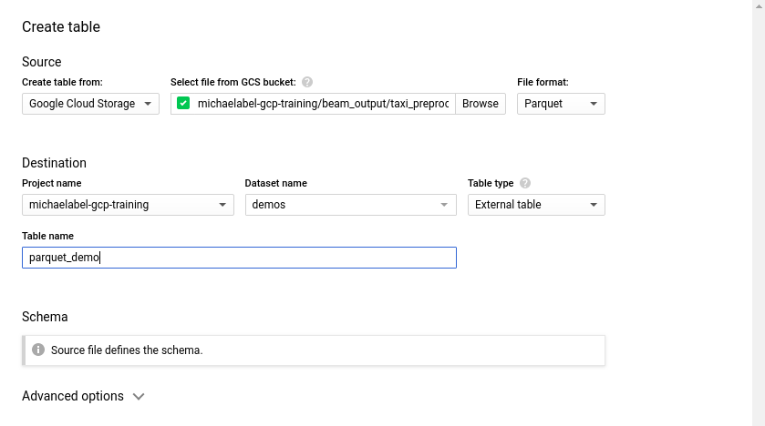
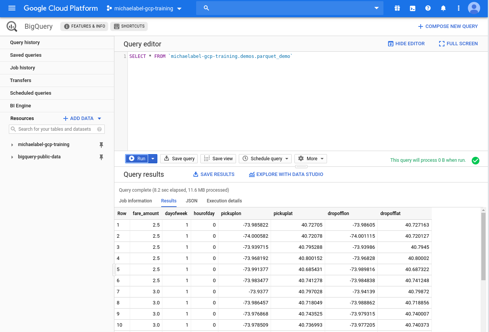
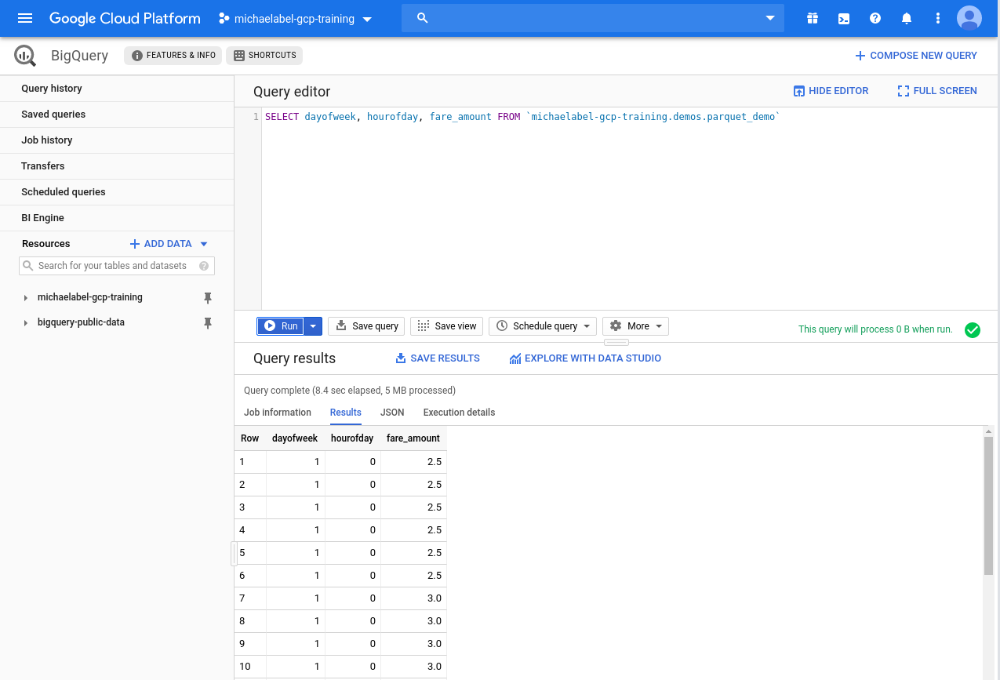

# BigQuery Demo: Federated query of parquet files in GCS

Goal: Give a quick introductory demo of querying parquet files saved in Google Cloud Storage. Note that this document is not written as a demo script per se, but rather as a walkthough.

## Setup for the demo:

### Option 1: Preexisting files in public GCS location.

You can copy over preexisting parquet files from the cloud-training GCS bucket. To do so simply run the gsutil command:

```bash
gsutil -m cp gs://cloud-training/bigquery/taxi* gs://<INSERT_YOUR_BUCKET>/
```

Once the file is present in your GCS bucket, you're ready to go! The rest of the demo script will be written with this file in mind, however, this demo can be adapted for your own data if you wish.

It will be helpful to have a dataset (say called `demos`) already created before starting the demo. To do this you can use the Web UI or the CLI command.

```bash
bq mk -d demos --location $LOCATION
```

Here `$LOCATION` should match the location of your GCS bucket.

The demo below will be written assuming this dataset exists before beginning.

### Option 2: Use your own data.

To use your own data you need to ensure that the data is in the parquet format. The `bq_to_parquet.py` script defines an Apache Beam pipeline to process data from BigQuery into the parquet format. The `bq_to_parquet.sh` script will install the neccessary packages on Cloud Shell to run this Apache Beam pipeline on Dataflow. The command to run the bash script is

```bash
bash bq_to_parquet.sh $PROJECT $DATASET $TABLE $BUCKET $REGION
```

Where `$PROJECT` is **both** the project owning the BigQuery dataset and billing project, `$DATASET` and `$TABLE` are the BigQuery dataset name and table name respectively. `$BUCKET` is the output GCS bucket and GCS bucket for staging and temporary storage for Dataflow. Finally `$REGION` is the compute region for Dataflow. You should ensure that the BigQuery dataset is stored in the same region for the best performance.

As a final note, if your BigQuery table has `ARRAY` fields you will need to uncomment line 30 in `bq_to_parquet.py` and if it has `STRUCT` fields you will need to uncomment line 31 in `bq_to_parquet.py`.

---

## The Demo

### Create external table.

First we will create an external table. We will do this within our "demos" dataset. First we click on the dataset and then click the "Create Table" button as shown below.

We will select "Google Cloud Storage" as our Source and our parquet file (`gs://<INSERT_YOUR_BUCKET>/file.parquet` e.g.) and choose "Parquet" at the file format. Ensure your project name is selected with the dataset "demos". The table time should be "External Table" and we will call the table `parquet_demo`.



Note that the schema is defined by the parquet file, so no need to specify this! Your screen should now look like the below image.



Now we're ready to create our table by clicking on the "Create Table" button.

### Show the schema of the table.

Now that we have loaded our data into BigQuery, let's look at the schema that BigQuery inferred from the parquet file. To do so, simply click on the newly loaded table under the `demos` dataset. BigQuery has interpreted the following schema from the file

| Field name | Type | Mode |
| --- | --- | --- |
|fare_amount| FLOAT| NULLABLE|
|dayofweek| INTEGER| NULLABLE|
|hourofday| INTEGER| NULLABLE|
|pickuplon| FLOAT| NULLABLE|
|pickuplat| FLOAT| NULLABLE|
|dropofflon| FLOAT| NULLABLE|
|dropofflat| FLOAT| NULLABLE|

Our table contains data on NYC Yellow Cab trips. We can see our field names and the types of the fields very easily. It isn't obvious from what we have seen, but the parquet file describes the schema of the table and BigQuery correctly interprets that information from the parquet file.

### Query the entire table.

Now that we have seen the schema, let's query the entire table. So we will simply run the query

```sql
SELECT * FROM `<your-project-name>.demos.parquet_demo`
```

Note that the query validator says that we will process 0B. This isn't because we will not be ingesting any data, but rather because the data is not stored in the BigQuery storage service. The amount of data being processed is calculated using metadata from the BQ storage service.

We can now run the query and see the results.



We can see in the query results that the query took 8.2 seconds and processed 11.6MB. Once again, without knowing about the parquet file itself, we could not have known how much data was being processed since this was a query against external data.

### Query selected columns.

However, parquet is a columnar data storage format. So, can BigQuery take advantage of this even though we're not ingesting it into the BigQuery storage service? Let's see by running the query


```sql
SELECT dayofweek, hourofday, fare_amount FROM `<your-project-name>.demos.parquet_demo`
```

Once again, the query validator will say that we will be processing 0B since the query is against external data.



Note that now only 5MB of data was processed! Why is this? This is because the BigQuery execution engine is able to parse the parquet file as columnar storage and only process the columns which it needs for the query. So in the case the columns for `dayofweek`, `hourofday` and `fare_amount` together are 5MB, not the 11.6MB of the entire dataset.
