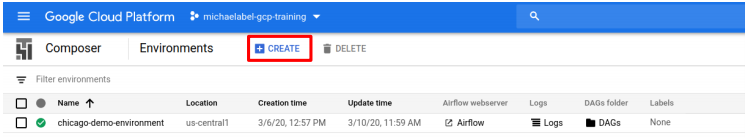
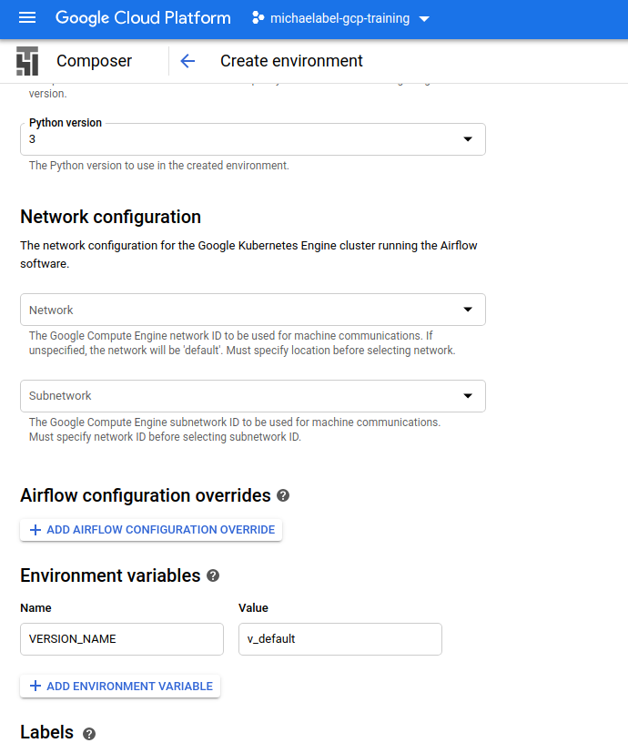
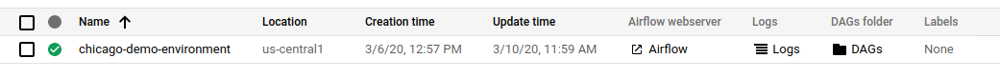
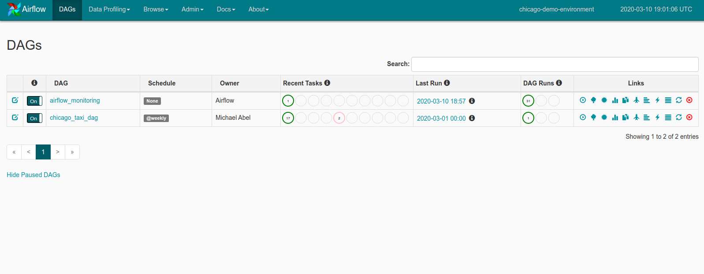
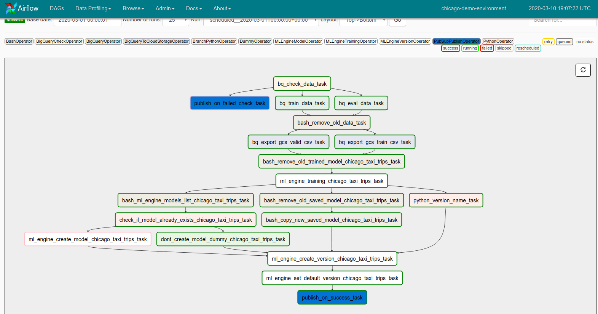

# Cloud Composer Demo: A simple example of an automated machine learning pipeline

Goal: Give a through introductory demo of Cloud Composer (Apache Airflow) for a machine learning pipeline which will update its model on a weekly cadence as long as there is fresh data. Note that there are other products used in this demo (BigQuery, GCS, Pub/Sub, Cloud AI Platform etc.), but this demo focuses in on the capabilities of Airflow and Composer.

**NOTE:** This is not a script in the true sense of the word, but rather a description of the DAG and the corresponding code in a more conversational tone. I would not recommend using this script word for word when explaining this demo to others. This document contains much more information than what is reasonable for a short demo, but has been used with a shortened form of the Cloud Composer module in its entirety.

## Setup for the demo:

In this directory is a file, `setup.sh`, which is a bash script to use the `gcloud` SDK to set up the GCP resources needed for this demo. You should run this script in Cloud Shell for the project you wish to show the demo in at least 35 minutes in advance to give Composer time to setup and for the DAG to run.

You will want to double check that all resources were setup successfully. `setup.sh` performs the following steps:

1. Sets up your Cloud Composer instance with a Variable named `VERSION_NAME`. If this is not the case then go to **Admin > Variables**, click **Create**, then set the key to `VERSION_NAME` and the value to `v_default`.
2. Creates a bucket called ${PROJECT_ID}-ml.
3. Creates a Pub/Sub topic named "chicago-taxi-pipeline"
4. Places the `trainer.tar` file in gs://$BUCKET/chicago_taxi/code/trainer.tar (BUCKET is the bucket created above)
5. Creates a BigQuery dataset called "demos"
6. Places DAG in DAGs Folder.

The `trainer.tar` file and the `chicago_taxi_dag.py` files are available in a public GCS bucket. (`gs://cloud-training/CPB200/Composer/`).

Note that in the demo, many of the steps that the script above handles for the presented are spelled out more explicitly for the students. Go into this detail as much as seems reasonable for the audience.

## Pricing and shutdown of the demo:

This demo should cost around $1.75. This assumes that the Composer cluster is set up with the default settings and is up for two hours. This also assumes that the deployed version of the model runs for two hours. If you leave the resources up and running after the demo, this price will increase.

Below is a list of the resources which are created by the demo which can be torn down once the demo is compeleted.

1. The Cloud Composer cluster named `chicago-demo-environment` with a corresponding GCS Bucket.
2. Objects in `gs://${PROJECT_ID}-ml/chicago_taxi/`
3. Pub/Sub topic named `chicago-taxi-pipeline`
4. Tables in the `demos` dataset in BigQuery: `chicago_taxi_trips_train_data` and `chicago_taxi_trips_valid_data`
5. A deployed model version on AI Platform under `chicago_taxi_trips`

## The Demo

### Overview

In this demo we will talk through setting up a Cloud Composer environment and a DAG to retrain a machine learning model for predicting taxifare data in the city of Chicago. This model will be retrained at a weekly cadence unless the data is stale.

### Setting up and exploring the Composer environment

Before we start talking through out example, let's walk through how to set up our Cloud Composer environment. We first go to **Big Data > Composer** in the side menu and then click on **Create.**



Once we hit create we will see the options for creating our environment. For this demo we will name our environment `chicago-demo-environment` and set our location to be `us-central1`. Finally we will set the Python version to be `3` and create an enviornment variable. We create the environment variable by clicking on the **ADD ENVIRONMENT VARIABLE** button. We then create a variable with name `VERSION_NAME` and value `v_default`.

After this, then we are ready to hit Create.



It will take 15-20 minutes to set up the environment, so instead of waiting I have another environment already set up and ready to go.

Note that we have three links here beside of the environment name. First we have a link to the Airflow server, we have a link to the logs in Stackdriver associated with the Composer environment, and finally we have a link to the DAGs folder. Let's click there first.



The DAGs folder is where we put the python scripts/packages used to define out Airflow pipelines. Notice that here I have two python scripts. First, there is the `airflow_monitoring.py` file. We also have the main focus of this demo, the `chicago_taxi_dag.py` file.

### Airflow webserver

This brings us to the main screen for the Airflow webserver. Note that we can see DAGs corresponding to the files we saw before. We will further explore the `chicago_taxi_dag` in a moment. Here we can see the schedule for the DAG (weekly for `chicago_taxi_dag`). Note that "None" under schedule means that the DAG will only run if it is triggered manually or via a Cloud Function.

We also see information about recent tasks. In this example we see that for `chicago_taxi_dag` we have 17 successful tasks and 2 skipped tasks, to the right of that we see when the last run was and the status of previous runs (here 1 successful run).



There are links on the right corresponding to things like "Trigger DAG", "Graph View", and others. Let us go and take a look at the Graph View now. Here we see the entire DAG. To get it to fit on a single screen let us go to Layout and switch it to "Top -> Bottom"



We will finish the demo by looking through the code for the DAG, but let's talk through the high level overview of the DAG first. Let's go through one task at a time.

#### `bq_check_data_task`

First we run a `BigQueryCheckOperator` task. This runs a simple query to check "data freshness", that is, have new taxi rides been added to the dataset in the last 30 days. If so, then we will pass the check, otherwise we will fail the check. This task has three downstream tasks:

* `publish_on_failed_check_task`
* `bq_train_data_task`
* `bq_eval_data_task`

Let's now talk through these task_ids

#### `publish_on_failed_check_task`

If the check fails, then we move to the `publish_on_failed_check_task`. This is a `PubSubPublishOperator` which will send a message to the specified Pub/Sub topic. We have set the trigger rule for this task to `ALL_FAILED`. This means that this task will only trigger if the upstream tasks all fail. The default behavior for triggers is `ALL_SUCCEED` which means that the task is triggered when all upstream tasks have succeeded. In this run note that the `bq_check_data_task` succeeded, so this task will be skipped (denoted by the pink outline around the task).

Also note that the different background colors correspond to the different types of tasks. The dark blue background corresponds to `PubSubPublishOperator` tasks for example. A legend of these tasks can be seen above the graph.

#### `bq_train_data_task` and `bq_eval_data_task`

Assuming the check succeeds, we move on to the next two tasks. Both of these tasks are `BigQueryOperator`s and execute similar queries to pull the data we want for our Chicago taxifare model from the public Chicago Taxi Trips dataset. We'll go through the query later, but roughly speaking we will use SQL to select the fields we wish to use, to clean the data, and to sample the data. We save the results in tables with the `WRITE_TRUNCATE` behavior; this means that we will not overwrite the table, but only add new rows to the dataset. We will use a 4/2500th sample for the training dataset and a 1/2500th sample for the evaluation dataset. Both of these tasks are upstream of the `BashOperator` called `bash_remove_old_data_task`.

#### `bash_remove_old_data_task`

We need to stage our data in Google Cloud Storage for our training job on Cloud AI Platform. This task removes the old data from the location where we will be pointing our training algorithm later. This task is upstream of two tasks `bq_export_gcs_valid_csv_task` and `bq_export_gcs_train_csv_task`.

#### `bq_export_gcs_valid_csv_task` and `bq_export_gcs_train_csv_task`

These tasks are `BigQueryToCloudStorageOperator`s. They do exactly what you would guess given the name. The tasks export the tables we just created from BigQuery to Google Cloud Storage. We will have separate locations for both the training and evaluation datasets. These tasks are upstream of the `bash_remove_old_trained_model_task`.

#### `bash_remove_old_trained_model_task`

Before moving on to training our model, we next remove the old trained model from our saved model location in Google Cloud Storage. Note that this is a different location than where we upload the trained model later, so that if something goes wrong in the training process, the current model is not lost. Downstream of this task is the `ml_engine_training_chicago_taxi_trips_task`.

#### `ml_engine_training_chicago_taxi_trips_task`

This is the task that submits our trainer package (`trainer.tar`) that we placed into our -ml bucket earlier to Cloud AI Platform with the data that we pulled in from BigQuery for training. Note that the name of the operator is `MLEngineTrainingOperator`. The operator was originally created when Cloud AI Platform was called Cloud ML Engine and the name of the operator has remained the same. After the training job finishes, we will save a copy of our trained model to GCS in the location where we removed the old trained model before in the previous task. After this task the pipeline branches into three tasks

* `bash_ml_engine_models_list_chicago_taxi_trips_task`
* `bash_remove_old_saved_model_chicago_taxi_trips_task`
* `python_version_name_task`

We will start out with the first branch as it is the most complex.

#### `bash_ml_engine_models_list_chicago_taxi_trips_task`

In this task (a `BashOperator`), we get a list of the currently existing models hosted on Cloud AI Platform. You can think of a model as a logical "folder" where versions of your model live. The version is the model itself. We will need to create a new model if one does not already exist but we will get there after the downstream task `check_if_model_already_exists_chicago_taxi_trips_task`.

#### `check_if_model_already_exists_chicago_taxi_trips_task`

This task is our first example of a `BranchPythonOperator`. We will take a look at the Python code in a moment, but what this does is it checks if the model name we want to use is already on the list from the previous task. But there could be an issue, how do we get that list of information to this task from the previous? They could be running in different pods. We use what is known as an XCom in Airflow. In the previous task we set `xcom_push = True` so that the results of the task are made available for other tasks. We use `xcom_pull` in the current task (in the Python callable being executed) to get these results and use them in this task. We'll point out this in the code when we get there.

Note that it is considered best practice to combine operators rather than using XComs if possible. I leave it as an exercise for you all to think through how you would do this.

Finally the python script does not return a boolean, but rather returns another operator (thus the "Branch" part of the operator name). We will trigger the task that is returned. The two possible tasks are `ml_engine_create_model_chicago_taxi_trips_task` and `dont_create_model_task_chicago_taxi_trips_task`.

#### `ml_engine_create_model_chicago_taxi_trips_task`

In the case that the model name is not included in our list, then we go to this task. In this task we create a new model on Cloud AI Platform with our chosen name. The downstream operator for this task is `ml_engine_create_version_chicago_taxi_trips_task`

#### `dont_create_model_task_chicago_taxi_trips_task`

In the case that the model name was included in our list, then we go to this task. This is an example of a `DummyOperator`. This is an operator that does nothing, but exists to fill a logical gap in our DAG. Since a `BranchPythonOperator` expects us to return an `Operator` of some sort in all cases, then we use this `DummyOperator` to fill the gap where we don't need to do anything and we want to move on to the next step. The downstream task for this task is `ml_engine_create_version_chicago_taxi_trips_task`. We will talk about this task soon, but first let us go through the other two downstream branches of the `ml_engine_training_chicago_taxi_trips_task`

#### `bash_remove_old_saved_model_chicago_taxi_trips_task`

In this task we will use a `BashOperator` to execute a `gsutil` command to remove the old saved model from the staging location. Once again we separated the location where Cloud AI Platform would save the model and where we would upload the model from to Cloud AI Platform for predictions so if something went wrong with the training process we would still have our current model in GCS. The downstreak task is `bash_copy_new_saved_model_chicago_taxi_trips_task`

#### `bash_copy_new_saved_model_chicago_taxi_trips_task`

The name of this task says it all. In this task we use a `BashOperator` to copy the trained model into our staging location. Now we have the model in place and ready to be uploaded to Cloud AI Platform. The downstream task is `ml_engine_create_version_chicago_taxi_trips_task`


#### `python_version_name_task`

The third downstream branch of the `ml_engine_training_chicago_taxi_trips_task` is this `PythonOperator`. This will execute a simple Python callable to set the new version name to be `"v_{CURRENT_TIMESTAMP}"`. We set the Airflow Variable `VERSION_NAME` instead of using a local variable so other pipelines can have access to this variable. A reason one would do this for example would be if other pipelines needed to reference the most recent model and you do not want to rely of default versions being set. The downstream task is `ml_engine_create_version_chicago_taxi_trips_task`

#### `ml_engine_create_version_chicago_taxi_trips_task`

Now the three branches of the pipeline come back together in this `MLEngineVersionOperator`. This operator creates a new version of our model (the model is created in an upstream branch if necessary) and uploads the staged trained model to Cloud AI Platform. The downstream task is `ml_engine_set_default_version_chicago_taxi_trips_task`.

#### `ml_engine_set_default_version_chicago_taxi_trips_task`

This us another ` MLEngineVersionOperator` which is used to set the current version (`VERSION_NAME`) to be the default version. The downstream (and terminal) task is `publish_on_success_task`

#### `publish_on_success_task`

This task publishes a message to our specified Pub/Sub topic once the DAG successfully runs. This can let another process downstream (outside of this DAG) know that the retraining process is finished or even notify a person that the process has completed.

### Some notes about the code.

We will now point out a few highlights in the `chicago_taxi_dag.py` file defining the DAG we just talked through.

```python
PROJECT_ID = _get_project_id()
```
This block of code retrieves the project id associated to the Cloud Composer cluster. The `_get_project_id` function gets this information from the Airflow variable corresponding to this information. If you're running this pipeline outside of Cloud Composer, you would need to manually set the corresponding variable.

```python
DEFAULT_ARGS = {
    'owner': 'Michael Abel',
    'depends_on_past': False,
    'start_date': datetime.datetime(2019, 12, 1),
    'email': ['michaelabel.gcp@gmail.com'],
    'email_on_failure': False,
    'email_on_retry': False,
    'retries': 1,
    'retry_delay': datetime.timedelta(minutes=5)
}
...
with DAG(
        'chicago_taxi_dag',
        catchup=False,
        default_args=DEFAULT_ARGS,
        schedule_interval='@weekly') as dag:
```

All of the code defining our DAG will be within the context defined above. Here we gave the DAG its name, we tell Airflow not to run the DAG "in the past" to catch up from the given start date, we give a dictionary of default arguments (such as the owner of the pipeline, retries and retry delay) and we specify the schedule interval. We can use special keywords (like the `'@weekly'` here) or use cron syntax.

```python
check_sql = """
              SELECT
                  COUNT(*)
              FROM
                  `bigquery-public-data.chicago_taxi_trips.taxi_trips`
              WHERE
                  trip_start_timestamp >= TIMESTAMP('{{ macros.ds_add(ds, -60) }}')
              """

  bq_check_data_op = BigQueryCheckOperator(
      task_id="bq_check_data_task",
      use_legacy_sql=False,
      sql=check_sql,
  )
```

In the SQL query we have the syntax `{{ macros.ds_add(ds, -60) }}`. This is an example of an Airflow macro for setting date. Here `ds_add` is adding -60 to the timestamp `ds`, which represents the current date. This sets the date to 60 days before the current date for the filter. We then run this query as part of a `BigQueryCheckOperator`, which if the result returned is nonzero returns a success, otherwise returns a failure.

```python
ERROR_MESSAGE = b64e(b'Error. Did not retrain on stale data.').decode()

publish_if_failed_check_op = PubSubPublishOperator(
    task_id="publish_on_failed_check_task",
    project=PROJECT_ID,
    topic=TOPIC,
    messages=[{'data': ERROR_MESSAGE}],
    trigger_rule = TriggerRule.ALL_FAILED
)
```

First notice the trigger rule in the `PubSubPublishOperator` arguments. Here we have the rule set to trigger the operator when all of the upstream tasks fail (in this case, the `BigQueryCheckOperator` from above). The only other thing to mention here is the format of the message. The message is a dictionary with 'data' as the key and the message as the value. Note that the message has to be encoded using base64 encoding and then decoded to be read in as a string due to the requirements of the `PubSubPublishOperator`.

```python
bq_train_data_op = BigQueryOperator(
    task_id="bq_train_data_task",
    bql=bql_train,
    destination_dataset_table="{}.{}_train_data"
            .format(DESTINATION_DATASET, model.replace(".", "_")),
    write_disposition="WRITE_TRUNCATE",  # specify to truncate on writes
    use_legacy_sql=False,
    dag=dag
)
```

The `BigQueryOperator`s are straightforward, note here that the `use_legacy_sql` argument is set to `False` since Legacy SQL is the default for this operator.

```python
bash_remove_old_data_op = BashOperator(
    task_id="bash_remove_old_data_task",
    bash_command=("if gsutil ls {0}/chicago_taxi/data/{1} 2> /dev/null;"
                  "then gsutil -m rm -rf {0}/chicago_taxi/data/{1}/*;"
                  "else true; fi").format(BUCKET, model.replace(".", "_")),
    dag=dag
)
```

The `BashOperator`s are all very similar, so we will just go through one example. Note that all we need is the bash command we wish to execute. In this case it's a simple if-else command to check to see if data is present, and then delete it if it is.

```python
bq_export_train_csv_op = BigQueryToCloudStorageOperator(
    task_id="bq_export_gcs_train_csv_task",
    source_project_dataset_table="{}.{}_train_data"
            .format(DESTINATION_DATASET, model.replace(".", "_")),
    destination_cloud_storage_uris=[train_files +
                                    "{}/train-*.csv"
                                    .format(model.replace(".", "_"))],
    export_format="CSV",
    print_header=False,
    dag=dag
)
```
Here we see the operator used to export data from BigQuery to Google Cloud Storage. It is mostly self-explanatory, but note that we must have our data saved in a table and we cannot define the table in the operator using a SQL query.

```python
# ML Engine training job
# ML Engine training job
  job_id = "chicago_{}_{}".format(model.replace(".", "_"),
                                  datetime.datetime.now()
                                  .strftime("%Y%m%d%H%M%S"))
  output_dir = (BUCKET + "/chicago/trained_model/{}"
                .format(model.replace(".", "_")))
  log_dir = (BUCKET + "/chicago/training_logs/{}"
                .format(model.replace(".", "_")))
  job_dir = JOB_DIR + "/" + job_id
  training_args = [
      "--job-dir", job_dir,
      "--output_dir", output_dir,
      "--log_dir", log_dir,
      "--train_data_path", train_files + "chicago_taxi_trips/*.csv",
      "--eval_data_path", valid_files + "chicago_taxi_trips/*.csv"
  ]

  ml_engine_training_op = MLEngineTrainingOperator(
      task_id="ml_engine_training_{}_task".format(model.replace(".", "_")),
      project_id=PROJECT_ID,
      job_id=job_id,
      package_uris=[PACKAGE_URI],
      training_python_module="trainer.task",
      training_args=training_args,
      region=REGION,
      scale_tier="BASIC",
      runtime_version="2.1",
      python_version="3.7",
      dag=dag
   )
```

In the `MLEngineTrainingOperator` we see the information we need to give to Cloud AI Platform to submit an ML training job. Note that we need to also pass training arguments which are used by the `trainer` package to execute the training job.

```python
bash_ml_engine_models_list_op = BashOperator(
    task_id="bash_ml_engine_models_list_{}_task"
            .format(model.replace(".", "_")),
    xcom_push=True,
    bash_command="gcloud ml-engine models list --filter='name:{0}'"
                 .format(MODEL_NAME),
    dag=dag
)

ef check_if_model_already_exists(templates_dict, **kwargs):
      cur_model = MODEL_NAME
      ml_engine_models_list = kwargs["ti"].xcom_pull(
          task_ids="bash_ml_engine_models_list_{}_task".format(cur_model))
      logging.info(("check_if_model_already_exists:"
                    "{}: ml_engine_models_list = \n{}"
                   .format(cur_model, ml_engine_models_list)))
      create_model_task = ("ml_engine_create_model_{}_task"
                           .format(cur_model))
      dont_create_model_task = ("dont_create_model_dummy_{}_task"
                                .format(cur_model))
      if (len(ml_engine_models_list) == 0 or
              ml_engine_models_list == "Listed 0 items."):
          return create_model_task
      else:
          return dont_create_model_task

  check_if_model_exists_op = BranchPythonOperator(
      task_id="check_if_model_already_exists_{}_task"
              .format(model.replace(".", "_")),
      templates_dict={"model": model.replace(".", "_")},
      python_callable=check_if_model_already_exists,
      provide_context=True,
      dag=dag
  )
```

Here is our first example of a `BranchPythonOperator`. Note that as mentioned before we have `xcom_push = True` set in the above `BashOperator`. This will make the output available for the Python callable. In this case the Python callable returns another task to be run depending on if the model has already been created. This will be the operator called downstream of this operator.

```python
ml_engine_create_model_op = MLEngineModelOperator(
    task_id="ml_engine_create_model_{}_task"
            .format(model.replace(".", "_")),
    project_id=PROJECT_ID,
    model={"name": MODEL_NAME},
    operation="create",
    dag=dag
    )

dont_create_model_dummy_op = DummyOperator(
    task_id="dont_create_model_dummy_{}_task"
            .format(model.replace(".", "_")),
    dag=dag
)
```

Here are the two possible operators to be called after the `BranchPythonOperator` in the previous code snippet. The `MLEngineModelOperator` will create a new model given the name, and the `DummyOperator` is a logical placeholder for the case that we do not want to create a model. This needs to be present, otherwise there would not be a way to define the flow of the graph when it merges downstream.

```python
bq_check_data_op >> publish_if_failed_check_op
bq_check_data_op >> [bq_train_data_op, bq_valid_data_op]
[bq_train_data_op, bq_valid_data_op] >> bash_remove_old_data_op
```

Finally, above are examples of us setting dependencies for the operators. The `>>` symbol is overloaded in Airflow to mean `.set_upstream()`. The first line simply says that `bq_check_data_op` is upstream of `publish_if_failed_check_op`.

The second line is an example of branching behavior, where we are setting `bq_check_data_op` to be upstream of both `bq_train_data_op` and `bq_check_data_op`. Note that these dependices can be set on separate lines and we can put any number of operators in the list.

The third line is an example of merging behavior. Here we're setting `bash_remove_old_data_op` to be downstream of both `bq_train_data_op` and `bq_check_data_op`. Like in the previous line, the could be split over multiple lines and the list can contain any number of operators.
