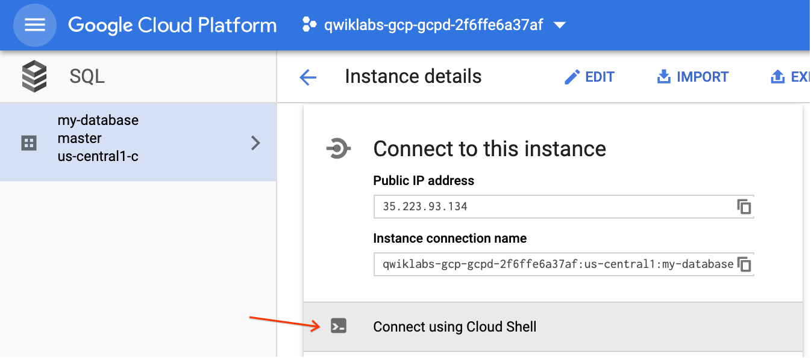
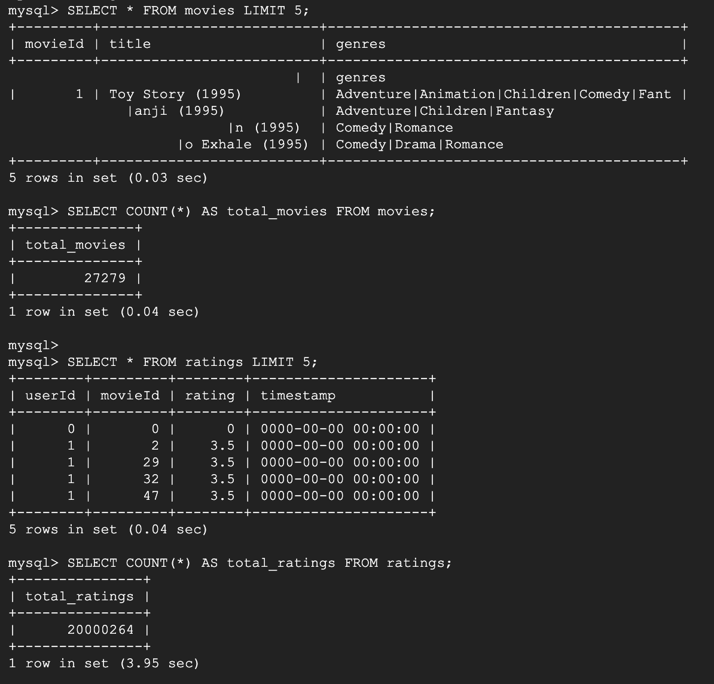
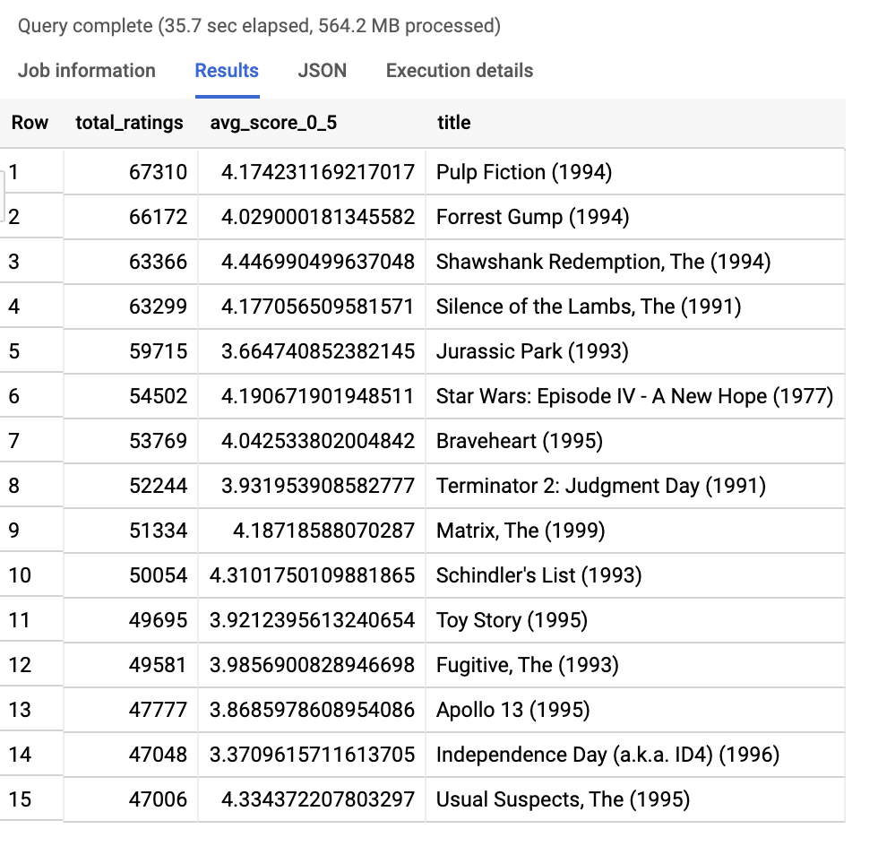
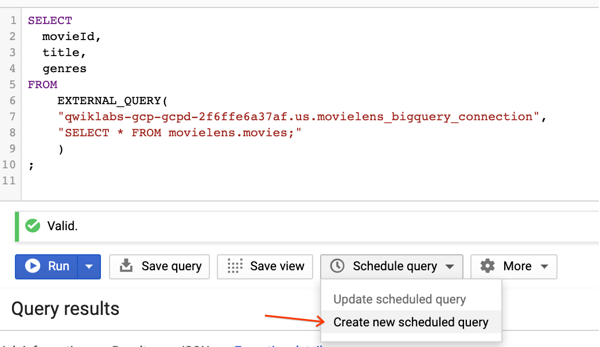
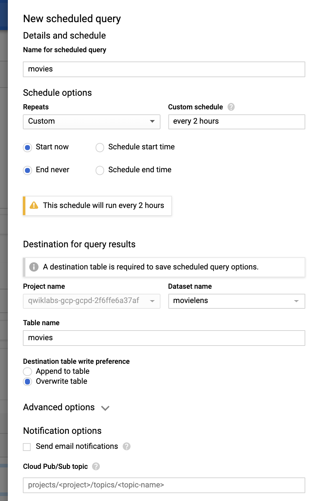

# Querying Data outside of BigQuery

An external data source (also known as a federated data source) is a data source that you can query directly even though the data is not stored in BigQuery. Instead of loading or streaming the data, you create a table that references the external data source.

## Currently supported external data sources
- Cloud Storage (CSV, Orc, Parquet, Avro, JSON, etc..)
- Cloud SQL (mySQL, SQL Server, PostGres)
- Google Drive (Google Sheets)
- BigTable 

Refer to the [documentation](https://cloud.google.com/bigquery/external-data-sources) for a complete list.

## Challenge: Simplify Extract Load Transform (ELT) with federated queries

In our example, we have a movie recommendations database stored in Cloud SQL (mySQL) that we want to query and possibly load into BigQuery for analytic workloads.

Goals
1. Load and Query mySQL data using Cloud Shell
2. Query the mySQL data directly from BigQuery
3. Load the data into BigQuery using simple SQL DDL
4. Create a recurring hourly export from mySQL --> BigQuery

## Load and Query mySQL data using Cloud Shell

https://cloud.google.com/sql/docs/postgres/import-export/importing#csv

```bash
gcloud sql instances create my-database --region=us-central1;
```

Navigate to [Cloud SQL instances](https://console.cloud.google.com/sql/instances) and confirm the database instance is being created. This takes 3-5 minutes. 

While you wait, you can preview the data we will be loading in on movies and user ratings:

```bash
# Let's show the first 1000 bytes of Movie data:
gsutil cat -r 0-1000 'gs://movielens-demo/movies.csv';

# Let's show the first 500 bytes of user Ratings data:
gsutil cat -r 0-500 'gs://movielens-demo/ratings.csv';
```

Once your instance is created, let's create the `movielens` database:

```bash
gcloud sql databases create movielens --instance=my-database;

gcloud sql databases list --instance=my-database;
```

## SSH into the Database to run SQL commands

Option 1: Using, Cloud Shell you can connect to your instance:

```bash
gcloud sql connect my-database -u root
```

When prompted, hit __enter__ to leave the password blank.

Option 2: Use the console UI



Create the empty schema to hold our movie ratings data:

```sql
USE movielens;

CREATE TABLE movies (
    movieId     integer NOT NULL,
    title       varchar(200),
    genres      varchar(40)
);

CREATE TABLE ratings (
    userId      integer NOT NULL,
    movieId     integer NOT NULL,
    rating      float NOT NULL,
    timestamp   integer
);

# Confirm there is no data yet:
SELECT * FROM movies LIMIT 5;

SELECT * FROM ratings LIMIT 5;
```

### Load in data from Cloud Storage

In new Cloud Shell tab (not in mySQL SSH terminal):

```bash
gcloud sql import csv \
my-database gs://movielens-demo/movies.csv \
--database=movielens --table=movies;

gcloud sql import csv \
my-database gs://movielens-demo/ratings.csv \
--database=movielens --table=ratings;
```

When prompted, press __Y__ to continue.

Loading ratings data will take 2-3 minutes (millions of ratings).


### Confirm basic data and row counts

Navigate back to your Cloud Shell mySQL SSH terminal tab and execute:

```sql
SELECT * FROM movies LIMIT 5;
SELECT COUNT(*) AS total_movies FROM movies;

SELECT * FROM ratings LIMIT 5;
SELECT COUNT(*) AS total_ratings FROM ratings;
```




### Anti-Pattern Running Analytic workloads on RDBMS

We want to know the top 15 most watched movies and what their rating was.

```sql
SELECT 
  COUNT(rating) AS total_ratings,
  AVG(rating) AS avg_score_0_5,
  title
FROM ratings AS r
LEFT JOIN movies AS m
ON r.movieId = m.movieId
GROUP BY title
ORDER BY total_ratings DESC
LIMIT 15;
```

How long did the query take to run? Did it complete? Note: Move on after waiting for over a minute. 

Is there a better alternative for running analytic workloads?


## Query the mySQL data directly from BigQuery

### Create an external data connection

__Enable__ the [BigQuery Connection API](https://console.developers.google.com/apis/api/bigqueryconnection.googleapis.com/overview)

Note: Before running the command, replace `YOUR-PROJECT-ID` in the two places below with your actual project ID.

```bash
bq mk --connection --connection_type='CLOUD_SQL' \
--properties='{"instanceId":"YOUR-PROJECT-ID:us-central1:my-database","database":"movielens","type":"MYSQL"}' \
--connection_credential='{"username":"root", "password":""}' \
--project_id=YOUR-PROJECT-ID --location=us movielens_bigquery_connection
```

Confirm you see a similar message:
`Connection 123456.us.movielens_bigquery_connection successfully created`

Navigate to BigQuery and run:

```sql
#BigQuery
SELECT total_ratings FROM 
  EXTERNAL_QUERY(
    "qwiklabs-gcp-gcpd-2f6ffe6a37af.us.movielens_bigquery_connection", 
    "SELECT COUNT(*) AS total_ratings FROM movielens.ratings;"
    );
```

Confirm you see the 20 million movie ratings from mySQL. 

Now, let's run the same query as before but let BigQuery do the actual aggregations and joins. 

```sql
SELECT 
  COUNT(rating) AS total_ratings,
  AVG(rating) AS avg_score_0_5,
  title
FROM 
  EXTERNAL_QUERY(
    "qwiklabs-gcp-gcpd-2f6ffe6a37af.us.movielens_bigquery_connection", 
    "SELECT * FROM movielens.ratings;"
    ) AS r
LEFT JOIN
    EXTERNAL_QUERY(
    "qwiklabs-gcp-gcpd-2f6ffe6a37af.us.movielens_bigquery_connection", 
    "SELECT * FROM movielens.movies;"
    ) AS m
ON r.movieId = m.movieId
GROUP BY title
ORDER BY total_ratings DESC
LIMIT 15;
```



## Load the data into BigQuery using simple SQL DDL

Create the BigQuery dataset `movielens`

```bash
bq mk movielens
```

Load the data from mySQL into BigQuery using SQL DDL statements:

```sql
CREATE OR REPLACE TABLE movielens.movies AS
SELECT 
  movieId,
  title,
  genres
FROM 
    EXTERNAL_QUERY(
    "qwiklabs-gcp-gcpd-2f6ffe6a37af.us.movielens_bigquery_connection", 
    "SELECT * FROM movielens.movies;"
    )
;

CREATE OR REPLACE TABLE movielens.ratings AS
SELECT 
  userId,
  movieId,
  rating,
  -- Need to convert from Integer to actual timestamp before saving 
  TIMESTAMP_SECONDS(timestamp) AS timestamp
FROM 
  EXTERNAL_QUERY(
    "qwiklabs-gcp-gcpd-2f6ffe6a37af.us.movielens_bigquery_connection", 
    "SELECT * FROM movielens.ratings;"
    ) 
;
```

__Note:__ Takes about 3-5 minutes to load via the federated connection

Execute the previous query and note the performance improvement now that the data is in BigQuery native storage:

```sql
# BigQuery
SELECT 
  COUNT(rating) AS total_ratings,
  AVG(rating) AS avg_score_0_5,
  title
FROM `movielens.ratings` AS r
LEFT JOIN `movielens.movies` AS m
ON r.movieId = m.movieId
GROUP BY title
ORDER BY total_ratings DESC
LIMIT 15;
```

__Note:__ If you omit the project-id in the FROM clause (project-id.dataset.table) BigQuery will assume your default project.

## Optional: Create a recurring hourly export from mySQL --> BigQuery

Once the data as been loaded and saved into BigQuery, it could become out of sync with the mySQL instance (since we're not connecting directly anymore). 

Let's setup a nightly load job as a Scheduled Query using the BigQuery Data Transfer Service.

Paste the below into the BigQuery editor:

```sql
SELECT 
  movieId,
  title,
  genres,
  # Record the time we snapshot the mySQL table
  CURRENT_TIMESTAMP() AS data_as_of
FROM 
    EXTERNAL_QUERY(
    "qwiklabs-gcp-gcpd-2f6ffe6a37af.us.movielens_bigquery_connection", 
    "SELECT * FROM movielens.movies;"
    )
;
```

Note: At the time of writing, you cannot have SQL DDL like `CREATE OR REPLACE TABLE` in a scheduled query. The scheduled query parameters specify the destination table. Additionally, you can only have one SQL statement run (you can't run multiple SELECT statements even if they are separated with semi-colons).



Fill in the prompts



__Tip:__ We will __overwrite__ the table every time with the updated data but you could store a historical archive of every snapshot you take by simply choosing __append__ and having a view or other table take the `MAX(data_as_of)` for the latest snapshot. You could even create an ingestion-time partitioned table for added performance.

Click __Schedule__

Your scheduled query should automatically begin to run and you can monitor it in [Scheduled Queries](https://console.cloud.google.com/bigquery/scheduled-queries)


