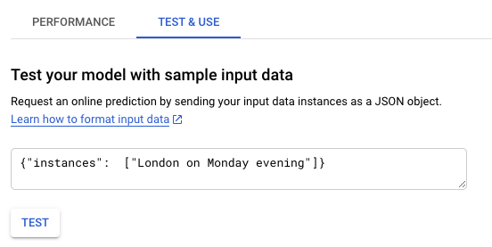

# Prediction

Open AI Platform and navigate to your [model](https://console.cloud.google.com/ai-platform/models), there is one model listed: 


Open the model and choose your version then click on the Tab `TEST & USE` and enter the following input data:

```
{"instances":  ["London on Monday evening"]}
```


After a couple of seconds, you get the prediction response. Where `London` got pedicted as geolocation (B-geo), and `Monday evening` as time where Monday is the beginning (B-tim) and evening is inisde (I-tim). 

```json
{
  "predictions": [
    [
      "B-geo",
      "O",
      "B-tim",
      "I-tim",
       ]
  ]
}
```

Congratulations you trained and deployed a Named Entity Recognition model where you can extract entities. There are many use cases where such models can be used.

Examples:

* Optimize search results by extract specific entities out of search queries.
* Classify large document archives by making entities filterable.
* Enhance access for digital research of large document archives.
* Route customer support message by extracting the department or product.

*Previous*: [Monitor the training](step-6-monitor-training.md)