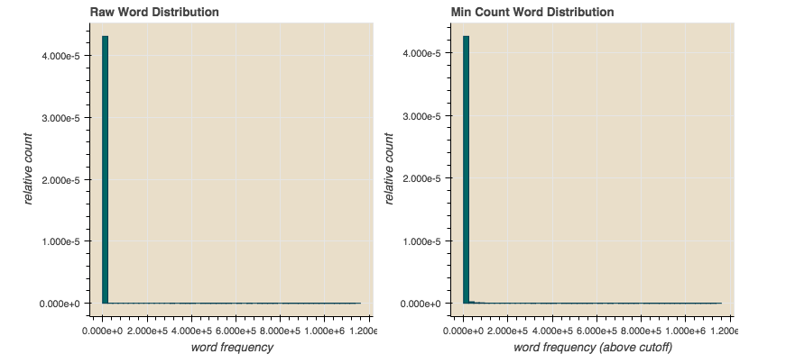
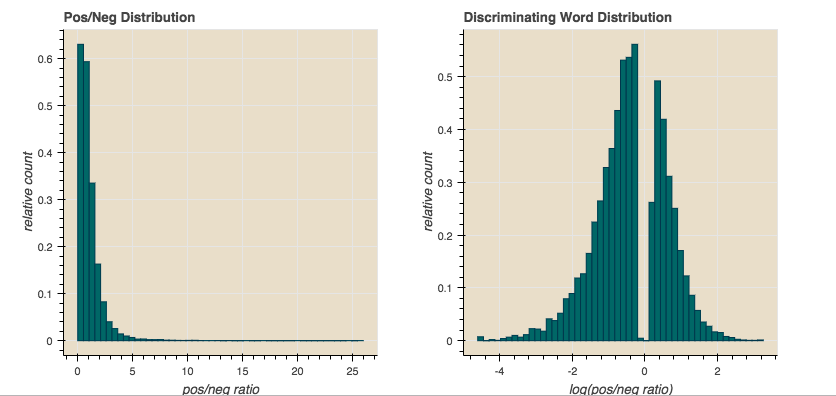

## Yelp Sentiment Notebook Demo
### yelp.ipynb

We're trying to create a neural network that detects sentiment, and
predicts whether a Yelp review (all 5 million of them) is positive or negative.
Reviews come from words.  Maybe we can look at the set of words in a review and make a guess from that?
 
Well let's see.  How frequently do some words occur?  Let's grab a sample of 100k positive and
negative reviews, 200k total.

The chart on the left shows that most words from 200,000
reviews are indistinguishable en masse,
so that's why naive approaches may take a long time to converge.
One approach is to look at words that occur more frequently.
When we cut off words that occur less than 50 times, we get
the chart on the right. We see the beginning of a distro, but it's weak.
We have to clean up the signal for our network
using a hypothesis of what's important.

So we calculate a ratio, how many words appear
in positive vs. negative reviews?  A value of 0 means
all negative reviews, 1.0 means equal distribution between
positive and negative, greater than 1.0 means more positive than
negative. Neural networks like values between -1 and 1 centered at 0.
Take the log(x)!  log(1) = 0,  log(1/x) = negative, log(n) = small.
Then lets cut out those that don't help much, the area around 0.
Voila.  A signal around 0, on the right!  Now let's train that on a simple network.

The network converges in a few minutes with 94% accuracy.
The weights on the input nodes are a vector representation of
semantics, so vectors close together are similar.
Here we see words that are somewhat similar, with some noise,
as we project from a 64-dimensional space to 2 dimensions.  Neat!
