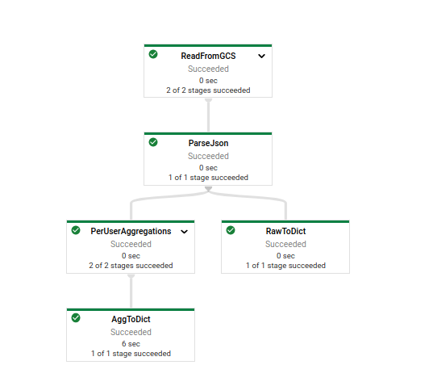
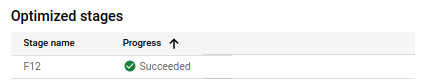
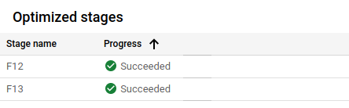
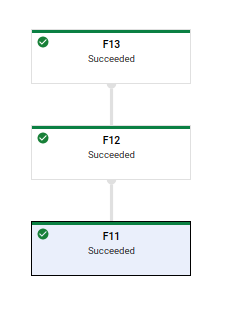

# Demo: Graph Optimization 

Goal: Show in a real example how graph optimization is occuring in Dataflow and call out opportunites for improving pipeline performance.

## Demo Setup and Notes

Included in this folder is an Apache Beam pipeline to run on Dataflow named `pipeline.py`. This pipeline is created to show the three types of graph optimizations that Dataflow will perform and does not include sinks for the sake of simplifying the graph of stages.

First, in Cloud Shell or your development environment, clone the repo (if you have not already)

```bash
git clone https://github.com/GoogleCloudPlatform/training-data-analyst
```

and the set your environment variables and create a GCS bucket and BigQuery dataset if needed (if you choose to uncomment the sinks)

```bash
cd ./training-data-analyst/courses/dataflow/demos/performance

PROJECT_ID=$(gcloud config get-value project)
REGION=us-central1
BUCKET=gs://$PROJECT_ID-df-demo

gsutil mb -l us-central1 $BUCKET
bq mk --location=US dataflow_demos
```

Now run the pipeline by executing the following command.


```bash
python3 pipeline.py \
    --project=$PROJECT_ID \
    --region=$REGION \
    --staging_location=$BUCKET/staging \
    --temp_location=$BUCKET/temp
```
## Walkthrough

First let us go to the Dataflow UI by going to **Dataflow > Jobs** and selecting the pipeline for the demo. The pipeline's name is `performance-demo-` followed by some timestamp. Once we click on the pipeline name we return to the Dataflow Monitoring UI for the job. First let us note the graph of transformations we've seen many times before.



This is a fairly simple pipeline, but one where we can see all possible types of Dataflow graph optimizations. First we read in the data from a text file in Google Cloud Storage, then we will parse the text file (which is in JSON) format before branching the pipeline into two branches. In one branch we will do per user aggregations and then convert back into Python dictionaries. For the second branch we will simply convert the parsed JSON into Python dictionaries. For the sake of the demo, the branches do not have sinks, but we could write these objects out from here.

Dataflow can perform three types of graph optimizations:

* Producer-Consumer Fusion: Two consecutive ParDos can be combined into a single ParDo to prevent unnecessary (de)serialization.
* Sibling Fusion: Two operations after a branch which could be done in parallel in the same stage are instead of separate stages. Once again, this prevents unnecessary (de)serialization.
* Combiner Lifting: An additional stage is added for a CombineFn to allow for partial results to be shuffled. This minimizes the amount of data which needs to be shuffled for GBK operations.

How do we figure out which transforms were fused and where combiner lifting occured? We can look at the stage names to determine this. If we click on the ParseJson transform, and scroll down on the right side of the UI, under "Optimized stages" we can see the stage name for the optimized stages.

**Note**: The exact name of the stages will differ based off run. In the run used for the images here, it was "F12"

 

We see that ParseJson has a single stage. This makes sense because it is a ParDo to parse lines of JSON into objects of type `TaxiRide`. Now let's click on ReadFromGCS and see what stages are there.

 

We see two different stages here for our source transform. This is a composite transform where shuffling will be involved, so this makes sense. But, notice that one of the stages is the same as ParseJson! This means that we are not shuffling between the second stage of ReadFromGCS and ParseJson, but rather everything is being done within the same container without shuffling data. This is a perfect example of Producer-Consumer fusion at work.

Now let's click on RawToDict. Note that the optimized stage is the same as ParseJson as well! More Producer-Consumer fusion at work.

Note that PerUserAggregations has two stages. As you may guess by the name we gave the transform, we're using a CombineFn here (in particular this is a SqlTransform with aggregation as part of the SQL statement. The first stage is the same as ParseJson and RawToDict. This means that we have an example of Sibling Fusion. Instead of shuffling the input for PerUserAggregations and RawToDict, we can do the first stages (only for RawToDict) in place and then shuffle data as needed. PerUserAggregations also is an example of Combiner Lifting. The first stage represents a partial aggegration in place and then a shuffle to the second stage where the aggregation is completed.

Finally, if we click on "Execution Details" and go to "Stage workflow" in the "Graph View" dropdown menu, we can see the pipeline graph expressed in stages instead of transforms.

 


