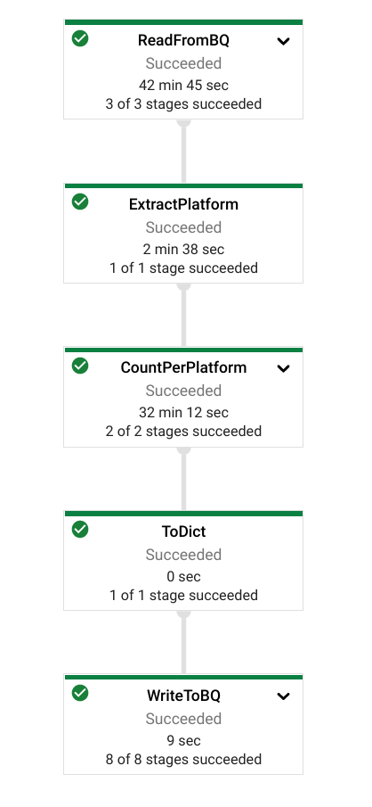
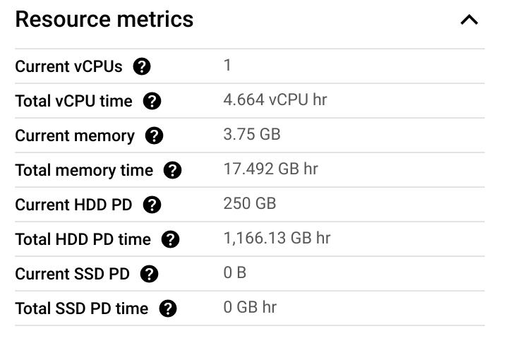
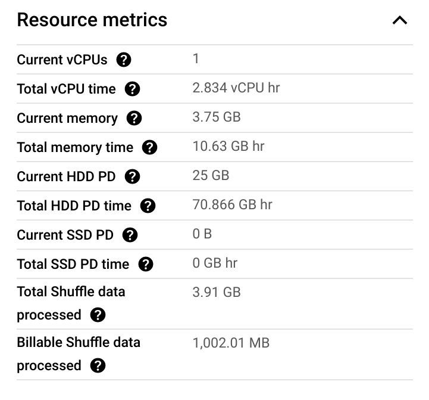

# Demo: Shuffle Service for Batch Processing

Goal: Give a simple, quick demo to show how to (de)activate the Dataflow Shuffle service. Compare the resource utilization for a simple pipeline using and not using the Shuffle service.

Note: This is not meant to be a script per se, but rather a walkthrough of different things to discuss around the Dataflow Shuffle service.

## Demo Setup and Notes

This demo should be ran in advance for the sake of time. Each pipeline takes around 20-25 minutes as of time of writing and run with a total cost of around $1.25.

Included in this folder is an Apache Beam pipeline to run on Dataflow named `shuffle_demo_pipeline.py`. This pipeline will be ran twice to show the differences between using the Dataflow Shuffle service and not using the Dataflow Shuffle service.

First clone the repo (if you have not already)

```bash
git clone https://github.com/GoogleCloudPlatform/training-data-analyst
```

and the set your environment variables and create a GCS bucket and BigQuery dataset if needed

```bash
cd ./training-data-analyst/courses/dataflow/demos/shuffle_service

PROJECT_ID=$(gcloud config get-value project)
REGION=us-central1
BUCKET=gs://$PROJECT_ID-df-demo

gsutil mb -l us-central1 $BUCKET
bq mk --location=US dataflow_demos
```

Run the first pipeline using Dataflow Shuffle service in Cloud Shell (or your development envrionment) using the following command

```bash
python3 shuffle_demo_pipeline.py \
    --project=$PROJECT_ID \
    --region=$REGION \
    --staging_location=$BUCKET/staging \
    --temp_location=$BUCKET/temp
```

The name of this pipeline will start with `shuffle-service-...`. Once the first pipeline has been submitted, then run the second pipeline as well. We include the experiment to not use the shuffle service in this case.

```bash
python3 shuffle_demo_pipeline.py \
    --project=$PROJECT_ID \
    --region=$REGION \
    --staging_location=$BUCKET/staging \
    --temp_location=$BUCKET/temp \
    --experiments=shuffle_mode=appliance
```

The name of this pipeline will start with `no-shuffle-service-...`. Once both pipelines are finished running then the demo is ready.

## Walkthrough

In this demo, we will explore resource consumption for two different Dataflow pipelines, one using the Dataflow Shuffle service and one not using the same service.

First let's explore the pipeline itself at a high-level. In this demo we will only discuss the pipeline topology and not dive into the code for the transforms.



First we read the table `bigquery-public-data:libraries_io.dependencies`, which is a publicly available table of data about dependencies managed by Libraries.io. After that we extract the the dependency platform field, count the number of times a platform is referenced, convert into a dictionary, and write the results into a BigQuery table in the `dataflow_demos` dataset in your project.

**Note:** This pipeline is not written in the most efficient manner! We could replace our custom `CountPerPlatform` PTransform with a combiner and execute a query in BigQuery to ingest only the fields we care about. The pipeline was built for this demo with additional shuffling in mind without increasing the amount of data being ingested. We want to show advantages of the Dataflow Shuffle service without running a costly pipeline!

Now let us look at the pipeline using the Dataflow Shuffle service. Go to menu in the Google Cloud console and go to **Dataflow > Jobs**. Select the job whose name starts with `no-shuffle-pipeline...`. 

On the right-hand side of the UI, we can see information about the job run. The amount of clock time it takes for a pipeline to run is not the best way to compare pipeline performance, since autoscaling may scale the pipeline to different amounts of VMs at different times. Instead we will look at the resource metrics on the right of the UI.



Without comparing to the pipeline using the Dataflow Shuffle service, it is a bit difficult to put these numbers into context. The pipeline processed 29.78 GB of data with 4.664 vCPU hr of compute time. We used 17.49 GB hr of memory time and 1166.13 GB hr of HDD PD time. Going to the [documentation](https://cloud.google.com/dataflow/pricing) for billing information, we can see that this pipeline cost around $0.71.

To put these numbers into a better context, let us now go back to the **Jobs** page by clicking the back arrow and selecting the job whose name starts with `shuffle-pipeline...`.



First notice that we have a couple of new rows. First we have "Total Shuffle data processed" and then we have "Billable Shuffle data processed". The total Shuffle data processed was 3.91 GB and billable Shuffle data processed was 1001.02 MB. Why the difference? The first 250 GB per job of Shuffle data processed is billed at 25% and the remaining first 5 TB is billed at 50%. So the Shuffle service processed 3.91GB of data, but we are only billed for 1001.02 MB in this case. You can see more information [here](https://cloud.google.com/dataflow/pricing#dataflow_shuffle_pricing_details).

Look at the other metrics now! The vCPU time decreased to 2.834 vCPU hr, the memory time to 10.64 GB hr and the HDD PD time to just 70.87 GB hr. With the shuffle service, we are no longer using persistent disks to manage intermediate state and shuffling, so we can greatly decrease their size, and thus utilization. 

Putting all of this together with the pricing in the documentation. We end up with a cost of $0.54 for this pipeline. This is a 24.5% reduction in price by just activating the Shuffle service!