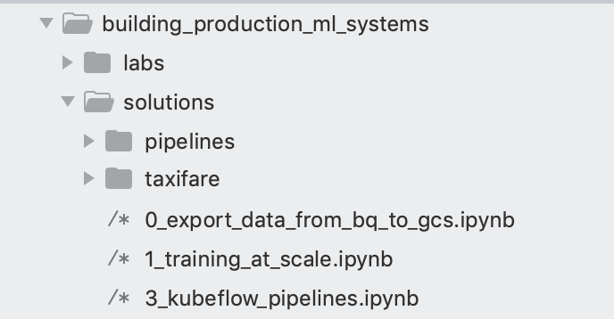

# Lab Creator Guide

## Creating Labs

### Folder and Naming structure

- __Naming:__ All folder and filenames should be in lowercase [snake_case](https://en.wikipedia.org/wiki/Snake_case) like `ml_notebook.ipynb` and not `MLNOTEBOOK.ipynb`

- __Numbering:__ Folders should be unnumbered `feature_engineering` and not `1_feature_engineering`. We will have a top level README that will handle the ordering. This provides flexibility if we need to add or remove modules.

- __Sub-folders:__ Each parent folder in `deepdive2` should represent a course module or roughly 1 day's worth of instructor-led training. Generally this is 4 - 8 labs depending on complexity. Inside the module folder there should only be two sub-folders `labs` and `solutions`. 



- __Labs__ folders contain 
1. Partially completed ipynbs with TODOs that map to learning objectives stated at the top of the lab (ideally with a number like TODO 1)
2. These ipynbs (or PDFs etc) should be numbered in the order of the labs for that modue
3. Any depedency code or images etc should be in sub-folders within `labs` so that the main `labs` folder only contains work the students need to complete. Example: images could be stored in an `assets` folder or similar

- __Solutions__ folders contain 
1. The fully completed and working solution code. Generally these are written and tested first before the lab notebooks are created.

### Reviews
- clone the training-data-analyst repo locally `https://github.com/GoogleCloudPlatform/training-data-analyst.git`
- create a new [branch](https://github.com/Kunena/Kunena-Forum/wiki/Create-a-new-branch-with-git-and-manage-branches)
- make [commits](https://help.github.com/en/desktop/contributing-to-projects/committing-and-reviewing-changes-to-your-project) and have [descriptive commit messages](https://chris.beams.io/posts/git-commit/)
- submit a [pull request](https://help.github.com/en/articles/about-pull-requests) comparing to the `master` branch and assign reviewers
- work through comments and get approval
- merge the PR (don't merge before approval)
- delete the branch
- work with TCD team to create a Qwiklab version and testing setup

#### Reviewer tips
- All labs should only have one h1 title at the very beginning
- Each lab should have Learning Objectives 
- Each student lab should have `TODOs` in the notebook that map to learning objectives
- All Python code must be [PEP8 style](https://www.python.org/dev/peps/pep-0008/) compliant ([online checker](http://pep8online.com/))
- Each lab should follow these pedagocial (training) best practices:
	1. Basic labs should take 30-45 minutes
	2. Advanced labs should take abut 60 minutes
	1. TBD :)

#### Commonly used code
- Getting the GCP project name

```bash
%%bash
export PROJECT=$(gcloud config list project --format "value(core.project)")
echo "Your current GCP Project Name is: "$PROJECT
```

- Environment variables
```bash
%%bash
import os

PROJECT = "your-gcp-project-here" # REPLACE WITH YOUR PROJECT NAME
REGION = "us-central1" # REPLACE WITH YOUR BUCKET REGION e.g. us-central1

# Do not change these
os.environ["PROJECT"] = PROJECT
os.environ["REGION"] = REGION
os.environ["BUCKET"] = PROJECT # DEFAULT BUCKET WILL BE PROJECT ID

if PROJECT == "your-gcp-project-here":
  print("Don't forget to update your PROJECT name! Currently:", PROJECT)
```

- Creating a GCS bucket and BQ dataset if it doesn't exist 

```bash
%%bash

## Create a BigQuery dataset for serverlessml if it doesn't exist
datasetexists=$(bq ls -d | grep -w serverlessml)

if [ -n "$datasetexists" ]; then
    echo -e "BigQuery dataset already exists, let's not recreate it."

else
    echo "Creating BigQuery dataset titled: serverlessml"
    
    bq --location=US mk --dataset \
        --description 'Taxi Fare' \
        $PROJECT:serverlessml
   echo "\nHere are your current datasets:"
   bq ls
fi    
    
## Create GCS bucket if it doesn't exist already...
exists=$(gsutil ls -d | grep -w gs://${PROJECT}/)

if [ -n "$exists" ]; then
   echo -e "Bucket exists, let's not recreate it."
    
else
   echo "Creating a new GCS bucket."
   gsutil mb -l ${REGION} gs://${PROJECT}
   echo "\nHere are your current buckets:"
   gsutil ls
fi
```

