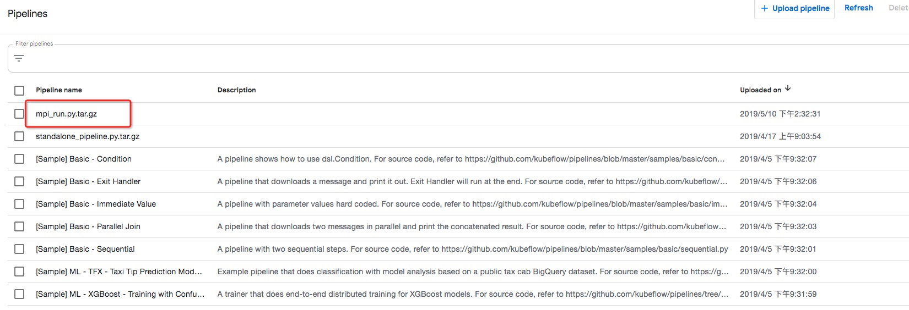
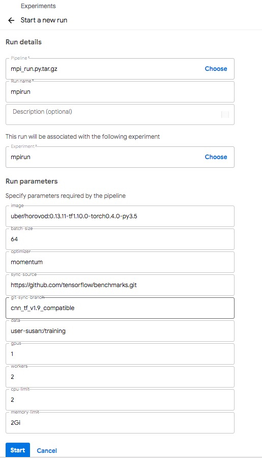
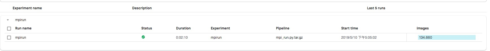

# Run a MPI Job

The `mpirun.py` sample creates a pipeline runs allreduce-style distributed training.

## Requirements

- [Install arena](https://github.com/kubeflow/arena/blob/master/docs/installation/README.md)

- This sample requires to create distributed storage. In this sample, we use NFS as example.

1.You need to create `/data` in the NFS Server

```
# mkdir -p /nfs
# mount -t nfs -o vers=4.0 NFS_SERVER_IP:/ /nfs
# mkdir -p /data
# cd /
# umount /nfs
```

2\.Create Persistent Volume. Moidfy `NFS_SERVER_IP` to yours.

```
# cat nfs-pv.yaml
apiVersion: v1
kind: PersistentVolume
metadata:
  name: user-susan
  labels:
    user-susan: pipelines
spec:
  persistentVolumeReclaimPolicy: Retain
  capacity:
    storage: 10Gi
  accessModes:
  - ReadWriteMany
  nfs:
    server: NFS_SERVER_IP
    path: "/data"
    
 # kubectl create -f nfs-pv.yaml
```

3\.Create Persistent Volume Claim.

```
# cat nfs-pvc.yaml
apiVersion: v1
kind: PersistentVolumeClaim
metadata:
  name: user-susan
  annotations:
    description: "this is the mnist demo"
    owner: Tom
spec:
  accessModes:
    - ReadWriteMany
  resources:
    requests:
       storage: 5Gi
  selector:
    matchLabels:
      user-susan: pipelines
# kubectl create -f nfs-pvc.yaml
```

> Notice: suggest to add `description` and `owner`

## Instructions

### 1.With command line to compile the python code to p

First, install the necessary Python Packages
```shell
pip3 install http://kubeflow.oss-cn-beijing.aliyuncs.com/kfp/0.1.16/kfp.tar.gz --upgrade
pip3 install http://kubeflow.oss-cn-beijing.aliyuncs.com/kfp-arena/kfp-arena-0.6.tar.gz --upgrade
```

Then run [mpi_run.py](mpi_run.py) with different parameters.

```
dsl-compile --py mpi_run.py --output mpi_run.py.tar.gz
```

Then, submit `[mpi_run.py.tar.gz](mpi_run.py.tar.gz)` to the kubeflow pipeline UI. 



You can use the mpirun pipeline definition to submit run, and choose the different parameters.



### 2.Check the result of the MPI Run pipeline


