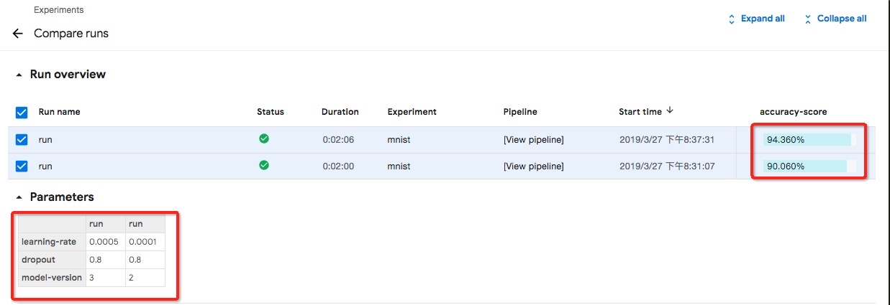

# Run a Standalone Job

The `standalone_pipeline.py` sample creates a pipeline runs preparing dataset, ML code, training and exporting the model.

## Requirements

- [Install arena](https://github.com/kubeflow/arena/blob/master/docs/installation/README.md)

- This sample requires to create distributed storage. In this sample, we use NFS as example.

1.You need to create `/data` in the NFS Server

```
# mkdir -p /nfs
# mount -t nfs -o vers=4.0 NFS_SERVER_IP:/ /nfs
# mkdir -p /data
# cd /
# umount /nfs
```

2\.Create Persistent Volume. Moidfy `NFS_SERVER_IP` to yours.

```
# cat nfs-pv.yaml
apiVersion: v1
kind: PersistentVolume
metadata:
  name: user-susan
  labels:
    user-susan: pipelines
spec:
  persistentVolumeReclaimPolicy: Retain
  capacity:
    storage: 10Gi
  accessModes:
  - ReadWriteMany
  nfs:
    server: NFS_SERVER_IP
    path: "/data"
    
 # kubectl create -f nfs-pv.yaml
```

3\.Create Persistent Volume Claim.

```
# cat nfs-pvc.yaml
apiVersion: v1
kind: PersistentVolumeClaim
metadata:
  name: user-susan
  annotations:
    description: "this is the mnist demo"
    owner: Tom
spec:
  accessModes:
    - ReadWriteMany
  resources:
    requests:
       storage: 5Gi
  selector:
    matchLabels:
      user-susan: pipelines
# kubectl create -f nfs-pvc.yaml
```

> Notice: suggest to add `description` and `owner`

## Instructions

### 1.With command line

First, install the necessary Python Packages
```shell
pip3 install http://kubeflow.oss-cn-beijing.aliyuncs.com/kfp/0.1.14/kfp.tar.gz --upgrade
pip3 install http://kubeflow.oss-cn-beijing.aliyuncs.com/kfp-arena/kfp-arena-0.5.tar.gz --upgrade
```

Then run [standalone_pipeline.py](standalone_pipeline.py) with different parameters.

```
python3 standalone_pipeline.py --learning_rate 0.0001 --dropout 0.8 --model_version 2
```

```
python3 standalone_pipeline.py --learning_rate 0.0005 --dropout 0.8 --model_version 3
```

### 2.With Jupyter Notebook
Run `jupyter notebook` to start running your jupyter server and load the notebook `standalone_pipeline.ipynb`


### 3.Compare the result in pipelines dashboard





