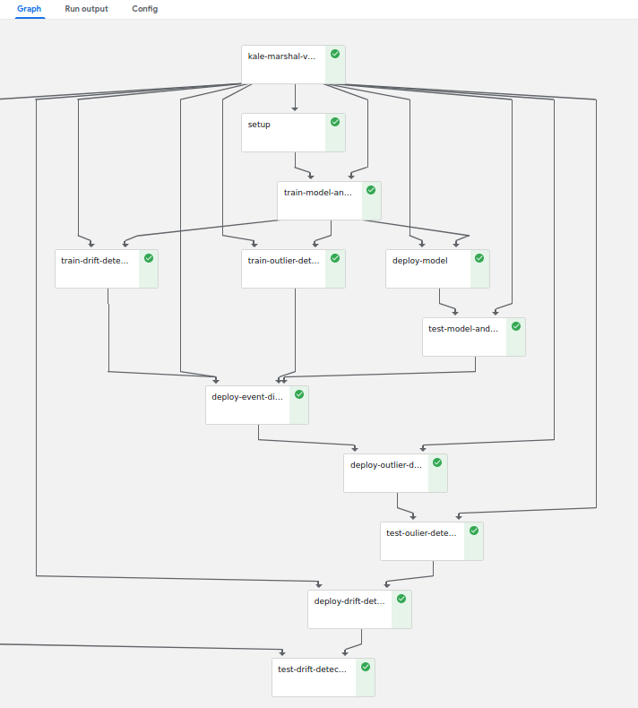
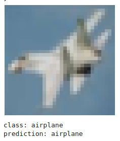
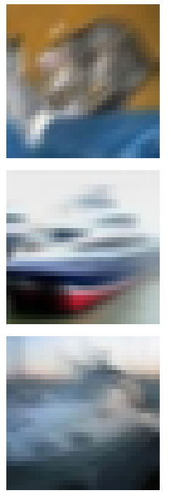
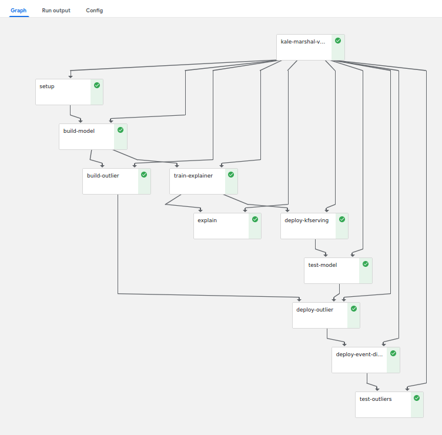

# KFServing End to End Deployment Examples

 * [CIFAR10 Image Classifier with Explainer, Outlier Detector and Drift Detector](#cifar10-image-classification-model)
 * [Income Classifier with Explainer and Outlier Detector](#income-classification-model)

## Running Pipelines

 * [See "tested on" section](../README.md#tested-on)

## Running in Kubeflow Jupyter Lab

 1. Create a new JupyterLab server using the image `seldonio/jupyter-lab-alibi-kale:0.11`
 

## CIFAR10 Image Classification Model

 * Tensorflow CIFAR10 Image Model with deployed explainer, outlier detector and drift detector
    * [Kale annotated Jupyter Notebook](./kfserving_e2e_cifar10.ipynb)
    * [GCP Pipeline](./kfserving_e2e_cifar10.kale.nfs.py)
      * Assumes `storage_class="nfs-client"`
    * [Default Pipeline](./kfserving_e2e_cifar10.kale.default.py)
      * Assumes a ReadWriteMany PVC will succeed on your cluster.




### Model Deployment and Predictions

Deploy a trained Tensorflow model and call the KFServing API to get predictions.



### Build and test a Model Explainer

Train an Anchor Images Explainer using [Alibi](https://github.com/SeldonIO/alibi) and test.


### Outlier Detector Deployment and Test

Deploy a trained outlier detector using [Alibi-Detect](https://github.com/SeldonIO/alibi-detect) and send corrupted images to the model to check they are marked as outliers.


### Drift Detector Deployment and Test

Create a drift detector using [Alibi-Detect](https://github.com/SeldonIO/alibi-detect) and deploy and test using motion blurred images.




## Income Classification Model

This example illustrates a simple tabular data use case built on [demographic features from a 1996 US census](https://archive.ics.uci.edu/ml/datasets/census+income) to create a binary classifier and attach explanations and outlier detection..

 * KFServing Income Classification Model with deployed explainer and outlier detector
    * [Kale annotated Jupyter Notebook](./kfserving_e2e_adult.ipynb)
    * [Pipeline](./kfserving_e2e_adult.kale.nfs.py)
      * Assumes `storage_class="nfs-client"`
    * [Pipeline](./kfserving_e2e_adult.kale.default.py)
      * Assumes a ReadWriteMany PVC will succeed on your cluster



### Model Predictions Explanations

```
Prediction:  <=50K
Anchor: Marital Status = Separated AND Sex = Female
Precision: 0.98
Coverage: 0.11
```

## Outlier Detection

```
{'data': {'instance_score': None, 'feature_score': None, 'is_outlier': [1]}, 'meta': {'name': 'IForest', 'detector_type': 'offline', 'data_type': 'tabular'}}
Outlier True
```
