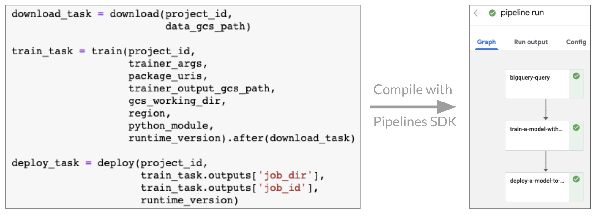
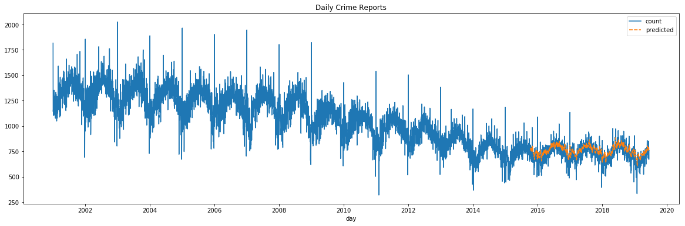

# AI Platform Components Sample

This sample demonstrates how to create a simple Kubeflow pipeline using standard AI Platform components.

The model predicts the number of crime reports expected today, given the daily totals from the previous week. It can illustrate how to do *automated model retraining* if it is configured as a recurring run in Kubeflow pipelines.

To use the TPU in the AI Platform Training service, check out these [samples](https://github.com/GoogleCloudPlatform/cloudml-samples/tree/950bc396bb5e45609e55ff401a333255cc47c29b/tpu)

## Pipeline

The pipeline has three steps:

1. **Query** historical crime reports from BigQuery and save as a CSV into a Google Cloud Storage bucket.
2. **Train** the model using the AI Platform Training service.
3. **Deploy** the model to the AI Platform Prediction service.

## Model

The model is a Long Short-Term Memory (LSTM) network consisting of 4 units with a dropout rate of 0.2. It is implemented with Tensorflow using the [Keras LSTM](https://www.tensorflow.org/api_docs/python/tf/keras/layers/LSTM) class.

## Dataset

The [Chicago Crime Data](https://console.cloud.google.com/marketplace/details/city-of-chicago-public-data/chicago-crime) includes crime reports in Chicago from 2001 to the present, and is publicly available in BigQuery.

## Assets

* Notebooks
  * **Chicago Crime Pipeline.ipynb** Illustrates how to build a **pipeline** and deploy it to a Kubeflow instance.
  * **./local/Chicago Crime Research.ipynb** Illustrates the process of building a **model** outside of production.
* Model training code
  * **./training**: includes the **training code** to build the model for use on AI Platform Training service.

## Getting Started

1. On a [Kubeflow cluster](https://www.kubeflow.org/docs/started/getting-started/), upload both notebooks to a running Notebook server.
2. Explore the research notebook to understand the model. No deployment step is required.
3. Create a [Google Cloud Platform project](https://console.cloud.google.com) if you don't already have one.
4. Create a [Google Cloud Storage bucket](https://console.cloud.google.com/storage/browser) if you don't already have one, to store the model assets.
5. From the pipeline notebook, update the required parameters in the `Constants` section to match your environment.
6. Run each step in the notebook.
7. Click the run link in the final step to view the pipeline in the Kubeflow Pipelines UI.
