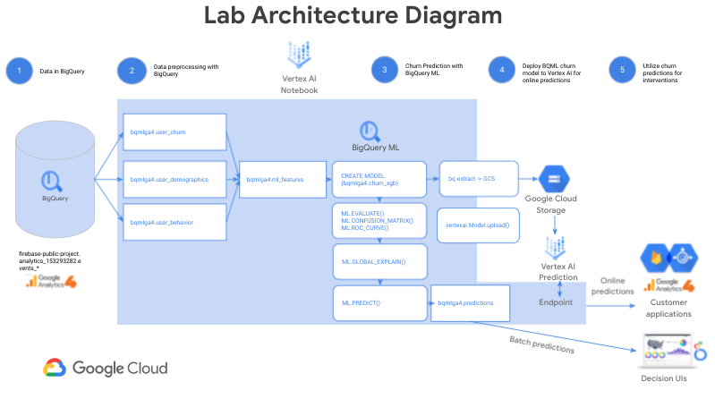

# Deploy a BigQuery ML user churn propensity model to Vertex AI for online predictions

In this lab, you will train, evaluate, explain, and generate batch and online predictions with a BigQuery ML (BQML) XGBoost model. You will use a Google Analytics 4 dataset from a real mobile application, Flood it! ([Android app](https://play.google.com/store/apps/details?id=com.labpixies.flood), [iOS app](https://itunes.apple.com/us/app/flood-it!/id476943146?mt=8)), to determine the likelihood of users returning to the application. You will generate batch predictions with your BigQuery ML model as well as export and deploy it to **Vertex AI** for online predictions.

[BigQuery ML](https://cloud.google.com/bigquery-ml/docs/introduction) lets you train and do batch inference with machine learning models in BigQuery using standard SQL queries faster by eliminating the need to move data with fewer lines of code. [Vertex AI](https://cloud.google.com/vertex-ai) is Google Cloud's complimentary next generation, unified platform for machine learning development. By developing and deploying BQML machine learning solutions on Vertex AI, you can leverage a scalable online prediction service and MLOps tools for model retraining and monitoring to significantly enhance your development productivity, the ability to scale your workflow and decision making with your data, and accelerate time to value.



Note: this lab is inspired by and extends [Churn prediction for game developers using Google Analytics 4 (GA4) and BigQuery ML](https://cloud.google.com/blog/topics/developers-practitioners/churn-prediction-game-developers-using-google-analytics-4-ga4-and-bigquery-ml). See that blog post and accompanying tutorial for additional depth on this use case and BigQuery ML. In this lab, you will go one step further and focus on how Vertex AI extends BQML's capabilities through online prediction so you can incorporate both customer churn predictions into decision making UIs such as [Looker dashboards](https://looker.com/google-cloud) but also online predictions directly into customer applications to power targeted interventions such as targeted incentives.

## Learning objectives

* Explore and preprocess a [Google Analytics 4](https://support.google.com/analytics/answer/7029846) data sample in [BigQuery]() for machine learning.  
* Train a [BigQuery ML (BQML)](https://cloud.google.com/bigquery-ml) [XGBoost](https://xgboost.readthedocs.io/en/latest/) classifier to predict user churn on a mobile gaming application.
* Evaluate the performance of a BQML XGBoost classifier.
* Explain your XGBoost model with [BQML Explainable AI](https://cloud.google.com/bigquery-ml/docs/reference/standard-sql/bigqueryml-syntax-xai-overview) global feature attributions.
* Generate batch predictions with your BQML XGBoost model.
* Export a BQML XGBoost model to a [Google Cloud Storage](https://cloud.google.com/storage).
* Upload and deploy a BQML XGBoost model to a [Vertex AI Prediction](https://cloud.google.com/vertex-ai/docs/predictions/getting-predictions) Endpoint for online predictions.

## Setup

### 1. Enable Cloud Services utilized in the lab environment:

#### 1.1 Launch [Cloud Shell](https://cloud.google.com/shell/docs/launching-cloud-shell)

#### 1.2 Set your Project ID

Confirm that you see the desired project ID returned below:
```
gcloud config get-value project
```

If you do not see your desired project ID, set it as follows:
```
PROJECT_ID=[YOUR PROJECT ID]
gcloud config set project $PROJECT_ID
```

#### 1.3 Use `gcloud` to enable the services

```
gcloud services enable \
  compute.googleapis.com \
  iam.googleapis.com \
  iamcredentials.googleapis.com \
  monitoring.googleapis.com \
  logging.googleapis.com \
  notebooks.googleapis.com \
  aiplatform.googleapis.com \
  bigquery.googleapis.com \
```

### 2. Creating a Vertex Notebooks instance

An instance of **Vertex Notebooks** is used as a primary lab environment.

To provision the instance follow the [Create an new notebook instance](https://cloud.google.com/vertex-ai/docs/general/notebooks) setup guide. Use the *TensorFlow Enterprise 2.3* no-GPU image. Leave all other settings at their default values.

After the instance is created, you can connect to [JupyterLab](https://jupyter.org/) IDE by clicking the *OPEN JUPYTERLAB* link in the [Vertex AI Notebooks Console](https://console.cloud.google.com/vertex-ai/notebooks/instances).


### 4. Clone the lab repository

In your **JupyterLab** instance, open a terminal and clone this repository in the `home` folder.
```
cd
git clone https://github.com/GoogleCloudPlatform/training-data-analyst.git
```

### 5. Navigate to lab notebook

In your **JupyterLab** instance, navigate to __training-data-analyst__ > __self-paced-labs__ > __vertex-ai__ > __vertex-bqml__, and open __lab_exercise.ipynb__.

Open `lab_exercise.ipynb` to complete the lab. 

Happy coding!