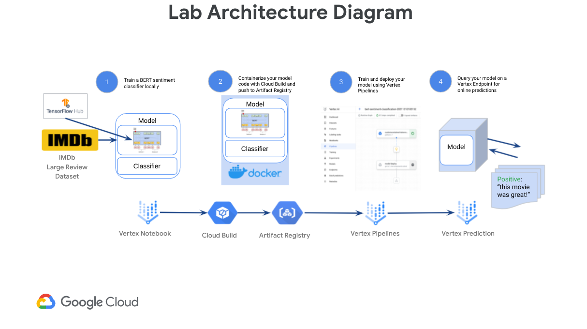

# Building Machine Learning solutions with Vertex AI: Challenge Lab

This Challenge Lab is recommended for students who have enrolled in the [**Building and deploying machine learning solutions with Vertex AI**](). You will be given a scenario and a set of tasks. Instead of following step-by-step instructions, you will use the skills learned from the labs in the quest to figure out how to complete the tasks on your own! An automated scoring system (shown on the Qwiklabs lab instructions page) will provide feedback on whether you have completed your tasks correctly.

When you take a Challenge Lab, you will not be taught Google Cloud concepts. To build the solution to the challenge presented, use skills learned from the labs in the Quest this challenge lab is part of. You are expected to extend your learned skills and complete all the **`TODO:`** comments in this notebook.

Are you ready for the challenge?

## Scenario

You were recently hired as a Machine Learning Engineer at a startup movie review website. Your manager has tasked you with building a machine learning model to classify the sentiment of user movie reviews as positive or negative. These predictions will be used as an input in downstream movie rating systems and to surface top supportive and critical reviews on the movie website application. The challenge: your business requirements are that you have just 6 weeks to productionize a model that achieves great than 75% accuracy to improve upon an existing bootstrapped solution. Furthermore, after doing some exploratory analysis in your startup's data warehouse, you found that you only have a small dataset of 50k text reviews to build a higher performing solution.

To build and deploy a high performance machine learning model with limited data quickly, you will walk through training and deploying a custom TensorFlow BERT sentiment classifier for online predictions on Google Cloud's [Vertex AI](https://cloud.google.com/vertex-ai) platform. Vertex AI is Google Cloud's next generation machine learning development platform where you can leverage the latest ML pre-built components and AutoML to significantly enhance your development productivity, scale your workflow and decision making with your data, and accelerate time to value.

First, you will progress through a typical experimentation workflow where you will build your model from pre-trained BERT components from TF-Hub and `tf.keras` classification layers to train and evaluate your model in a Vertex Notebook. You will then package your model code into a Docker container to train on Google Cloud's Vertex AI. Lastly, you will define and run a Kubeflow Pipeline on Vertex Pipelines that trains and deploys your model to a Vertex Endpoint that you will query for online predictions.

## Learning objectives

* Train a TensorFlow model locally in a hosted [**Vertex Notebook**](https://cloud.google.com/vertex-ai/docs/general/notebooks?hl=sv).
* Containerize your training code with [**Cloud Build**](https://cloud.google.com/build) and push it to [**Google Cloud Artifact Registry**](https://cloud.google.com/artifact-registry) as part of a Vertex custom container training workflow.
* Define a pipeline using the [**Kubeflow Pipelines (KFP) V2 SDK**](https://www.kubeflow.org/docs/components/pipelines/sdk/v2/v2-compatibility) to train and deploy your model on [**Vertex Pipelines**](https://cloud.google.com/vertex-ai/docs/pipelines).
* Query your model on a [**Vertex Endpoint**](https://cloud.google.com/vertex-ai/docs/predictions/getting-predictions) using online predictions.