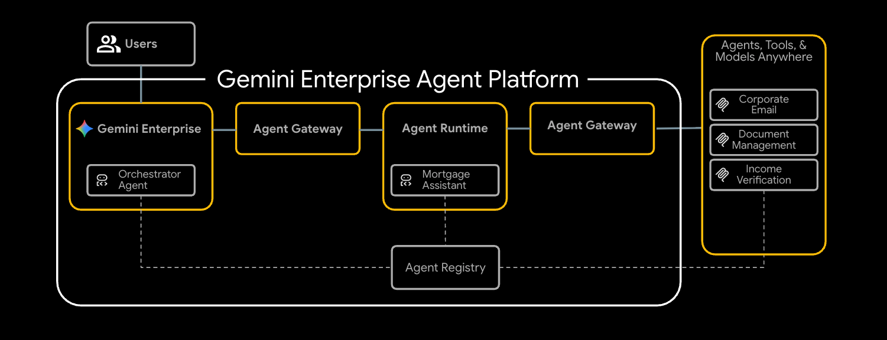

# Securing Cross-Cloud Agentic Enterprise Deployments

Supporting code for the
[Governing agentic workloads with Agent Gateway on Gemini Enterprise Agent Platform](https://codelabs.developers.google.com/cloudnet-agent-gateway)
codelab.


A multi-tool ADK mortgage agent runs on Vertex AI Agent Runtime and reaches
three internal MCP servers (`legacy-dms`, `corporate-email`,
`income-verification-api`) on Cloud Run through the **Agent Gateway**. IAP
REQUEST_AUTHZ enforces per-tool IAM via Agent Identity, and a Model Armor
CONTENT_AUTHZ extension screens prompts and responses. Tool URLs are
discovered at runtime through the Agent Registry rather than baked into the
agent. End-to-end execution is observable in Cloud Trace.

## Architecture



## Deployment modes

You pick one of two paths when configuring Terraform via the
`enable_cloud_run_private_networking` flag:

| Mode | Cloud Run ingress | Agent Registry URLs | Extra requirements |
| --- | --- | --- | --- |
| **Default (public)** | `all` | `*.run.app` | None |
| **Secure (private)** | `internal-and-cloud-load-balancing` | `<svc>.<your-domain>` via internal ALB | A public DNS zone you own + a Google-managed cert |

## Repository layout

```
agent-gateway/
├── src/
│   ├── corporate-email/             # Python — MCP corporate email service
│   ├── income-verification-api/     # Python — MCP income verification API
│   ├── legacy-dms/                  # Python — MCP legacy document management
│   └── mortgage-agent/              # Python — ADK agent + deploy_agent.py
├── terraform/
│   ├── main.tf, variables.tf, outputs.tf, backend.tf, versions.tf
│   ├── example.tfvars, example.backend.conf
│   └── modules/
│       ├── foundation/              # Project services, APIs, IAM
│       ├── networking/              # VPC, subnets, firewall, PSC
│       ├── dns/                     # Public + private Cloud DNS zones
│       ├── certificates/            # Certificate Manager (private path)
│       ├── agent-engine/            # Agent Runtime infrastructure
│       ├── agent-gateway/           # Agent Gateway + service extensions
│       ├── agent-registry-endpoints/ # Tool registration scripts
│       ├── mcp-cloud-run/           # Cloud Run services + per-svc runtime SAs
│       ├── mcp-internal-lb/         # Internal ALB + Serverless NEG (private)
│       └── model-armor/             # Model Armor templates + DLP integration
├── cloudrun/                        # Cloud Run service templates (envsubst)
│   ├── corporate-email.yaml.tmpl
│   ├── income-verification-api.yaml.tmpl
│   └── legacy-dms.yaml.tmpl
├── scripts/
│   └── grant_agent_mcp_egress.sh    # Per-MCP IAP egress IAM (run after deploy)
├── skaffold.yaml.tmpl               # Multi-service build + Cloud Run deploy
├── codelab.md                       # Full walkthrough (source of truth)
└── docs/architecture.png
```

## Prerequisites

- A Google Cloud project with billing enabled
- `gcloud` (Cloud SDK)
- `terraform` >= 1.5
- [`skaffold`](https://skaffold.dev/) for image builds
- Python 3.12+ with [`uv`](https://docs.astral.sh/uv/)
- `envsubst` (gettext) and `jq` — Cloud Shell already has these
- (Secure path only) A public DNS zone you own, used for the LB cert

## Quick start

The full procedure with explanations lives in [`codelab.md`](codelab.md).
Condensed:

```bash
export PROJECT_ID="<your-project-id>"
export REGION="us-central1"
# Secure path only:
export DOMAIN_NAME="agw.example.com"

# 1. Bootstrap APIs
gcloud services enable \
  compute.googleapis.com serviceusage.googleapis.com \
  cloudresourcemanager.googleapis.com iam.googleapis.com \
  storage.googleapis.com dns.googleapis.com

# 2. Create state bucket and configure backend
gcloud storage buckets create gs://${PROJECT_ID}-tfstate \
  --location=${REGION} --uniform-bucket-level-access
cp terraform/example.backend.conf terraform/backend.conf
# Edit backend.conf

# 3. Configure Terraform variables
cp terraform/example.tfvars terraform/terraform.tfvars
# Edit terraform/terraform.tfvars (see codelab.md for the variable reference)

# 4. Deploy infrastructure
cd terraform
terraform init -backend-config=backend.conf
terraform plan
terraform apply
cd ..

# 5. Render skaffold + cloudrun manifests. MCP_INGRESS comes from a
#    Terraform output that mirrors enable_cloud_run_private_networking,
#    so the rendered Cloud Run YAML stays in sync with Terraform state.
export MCP_INGRESS=$(cd terraform && terraform output -raw mcp_cloud_run_ingress_annotation)
envsubst '${PROJECT_ID} ${REGION} ${MCP_INGRESS}' < skaffold.yaml.tmpl > skaffold.yaml
for f in cloudrun/*.yaml.tmpl; do
  envsubst '${PROJECT_ID} ${REGION} ${MCP_INGRESS}' < "$f" > "${f%.tmpl}"
done

# 6. Build images and deploy MCP services
gcloud projects add-iam-policy-binding ${PROJECT_ID} \
  --member="user:$(gcloud config get-value account)" \
  --role="roles/iam.serviceAccountUser"
skaffold run

# 7. Deploy the mortgage agent to Agent Runtime
cd src/mortgage-agent
uv sync
uv run python deploy_agent.py \
  --project=${PROJECT_ID} --region=${REGION} \
  --enable-agent-identity --agent-name=mortgage-agent \
  --agent-gateway=projects/${PROJECT_ID}/locations/${REGION}/agentGateways/agent-gateway \
  --model-endpoint-location=global
# Capture AGENT_ID from the output
cd ../..

# 8. Grant per-MCP egress IAM for the deployed agent
./scripts/grant_agent_mcp_egress.sh \
  --mcp \
  --agent-id ${AGENT_ID} \
  --mcp-filter "legacy-dms income-verification"
```

## Test, register, clean up

- **Playground:** open the agent in the Agent Platform console and trigger a
  prompt; verify in Cloud Trace.
- **Gemini Enterprise:** register the agent in your GE app and chat through
  the GE webapp.
- **Cleanup:** `terraform destroy` (after deleting the deployed Reasoning
  Engine first).

Each is covered in [`codelab.md`](codelab.md), including troubleshooting
(gateway settle time, missing IAM, DNS peering, image tag conflicts).

## Contributing

See [docs/CONTRIBUTING.md](docs/CONTRIBUTING.md).

## License

[Apache License 2.0](LICENSE)
