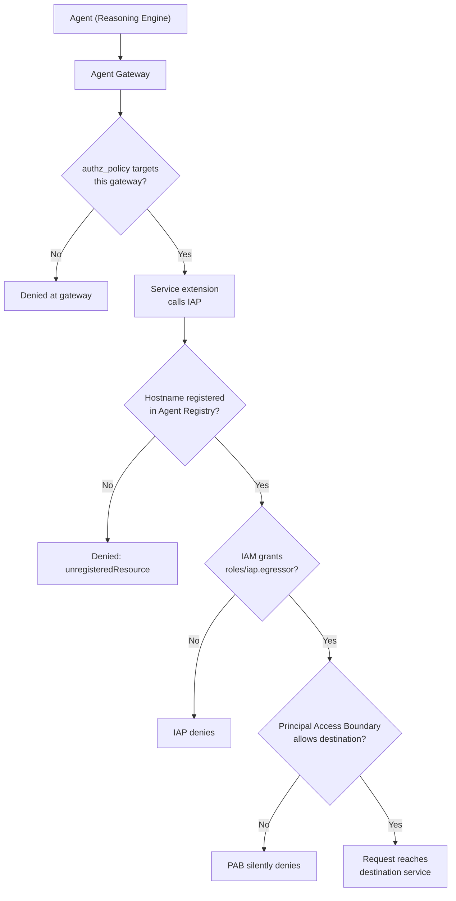
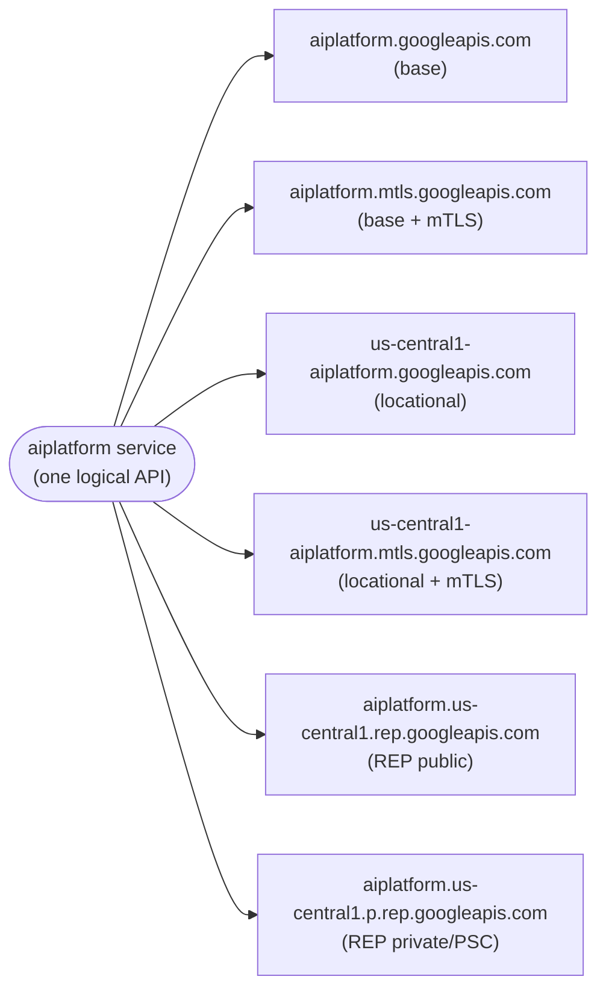
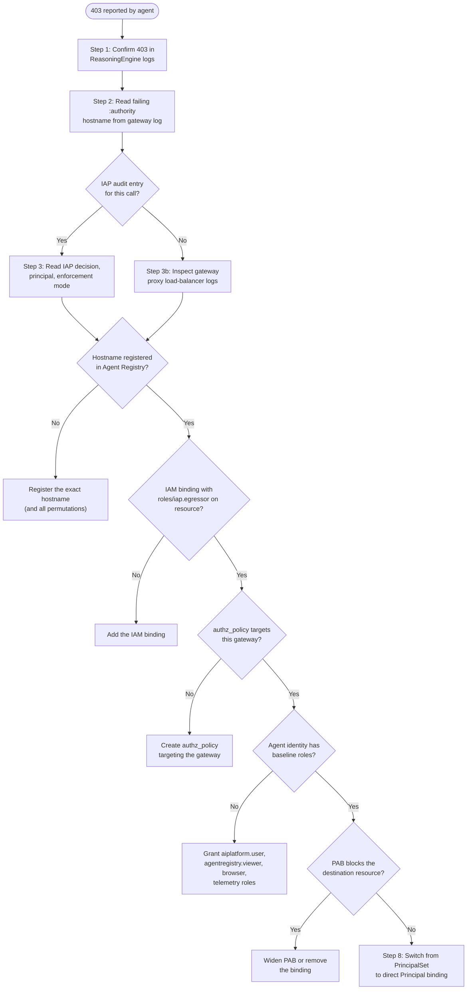

# Troubleshoot the Gemini Enterprise Agent Platform

This guide helps you diagnose authorization and connectivity failures on Google Cloud's Gemini Enterprise Agent Platform — Agent Gateway, Agent Registry, Agent Identity, agent policies, and Identity-Aware Proxy (IAP) delegated authorization.

This document is the human-readable companion to the `agent-platform-debugger` A skill at `.agents/skills/agent-platform-debugger/`. The skill packages the same knowledge for AI-assisted debugging; this guide presents it for someone reading top-to-bottom.

> **Scope.** This guide covers the Gemini Enterprise Agent Platform stack. It does not cover general Google Cloud IAM debugging unrelated to the platform, plain VPC Service Controls perimeters, or Cloud Run authentication outside the agent context.

## Contents

- [Before you begin](#before-you-begin)
- [How agent egress is authorized](#how-agent-egress-is-authorized)
- [Hostname permutations are the most common cause](#hostname-permutations-are-the-most-common-cause)
- [Diagnose a 403 from an agent](#diagnose-a-403-from-an-agent)
- [Common issues](#common-issues)
- [Reference](#reference)

---

## Before you begin

### Permissions you need to triage

To work through this guide, your user account or service account needs read access to the following surfaces:

- `roles/logging.viewer` — to read ReasoningEngine, gateway, and IAP audit logs in Cloud Logging.
- `roles/iap.settingsAdmin` — to read IAM policies on Agent Registry resources through the IAP API.
- `roles/agentregistry.viewer` — to list registered endpoints, MCP servers, and agents.
- `roles/networkservices.viewer` — to inspect Agent Gateway and authz policies.
- `roles/iam.securityReviewer` — to read IAM bindings and Principal Access Boundary (PAB) policies at the project and organization scope.

You also need the Google Cloud CLI (`gcloud`) installed, with `gcloud beta` and `gcloud alpha` components available, and `curl` for direct API calls.

### Variables used in this guide

The shell snippets in this guide use these variables. Set them once for your environment before running the commands.

| Variable | Description | Example |
|---|---|---|
| `PROJECT_ID` | The consumer project that runs the agent. | `my-agent-project` |
| `PROJECT_NUMBER` | Numeric ID of the same project. | `123456789012` |
| `LOCATION` | Region of the agent and registry. | `us-central1` |
| `REGION` | Region of the Agent Gateway (often the same as `LOCATION`). | `us-central1` |
| `AGENT_ID` | The Reasoning Engine ID. | `1234567890123456789` |
| `AGENT_GATEWAY_NAME` | Name of the Agent Gateway resource. | `prod-agent-gateway` |
| `ENDPOINT_ID` | An Agent Registry endpoint ID. | `aiplatform-us-central1` |
| `MCP_SERVER_NAME` | An Agent Registry MCP server name. | `mcp-customer-data` |
| `ORGANIZATION_ID` | Numeric Google Cloud organization ID. | `987654321098` |
| `PRINCIPAL_SET` | A `principalSet://...` URI for the agent identity. | (see [Glossary](#glossary)) |

---

## How agent egress is authorized

Every outbound call from an agent traverses several layers of authorization. Each layer denies by default. A missing entry at any layer returns the same generic 403 response, which is why diagnosis hinges on identifying which layer rejected the call.

### Authorization layers



The layers, in order:

1. **Agent Registry.** The destination must be registered as an endpoint, MCP server, or agent. Anything not registered is denied.
2. **Agent Gateway.** The gateway sits in front of the agent's egress. An `authz_policy` must explicitly *target* the gateway resource, otherwise the configured authorization extension is not applied.
3. **Service extension (delegated authorization).** The gateway calls IAP through a service extension to make an allow or deny decision.
4. **IAP and IAM.** The agent's identity must hold `roles/iap.egressor` on the registered resource, either directly or through a principal set the agent belongs to.
5. **Principal Access Boundary (PAB).** A PAB policy on the principal set can restrict which resources its members reach. **PAB takes precedence over IAM Allow.** A correct binding does nothing if a PAB scopes the principal away from the target.

> **Under the hood.** Agent Gateway runs on a Google-managed Secure Web Proxy instance that provides the egress proxy capabilities. You do not configure the proxy directly. Its rules derive from your Agent Registry entries and authz policies. Denials from the proxy layer surface in load-balancer logs (see [Log queries](#log-queries)), which is useful when a request is blocked before IAP gets a chance to make an authorization decision.

### What a denial looks like

The canonical 403 in agent logs is:

```json
{"code": 403, "message": "403 Forbidden. {'message': 'Egress request is not authorized.', 'status': 'Forbidden'}"}
```

To triage a 403, identify which layer rejected the call. The flow in [Diagnose a 403 from an agent](#diagnose-a-403-from-an-agent) walks each layer in most-likely-cause order.

---

## Hostname permutations are the most common cause

A Google Cloud API such as `aiplatform.googleapis.com` is reachable through many distinct hostnames. The agent's SDK calls one of them depending on the SDK version, regional client configuration, or whether mTLS is in play.

### Why one API has many hostnames

For service `aiplatform` in region `us-central1`, all of the following resolve to Vertex AI:



| Form | Example |
|---|---|
| Base | `aiplatform.googleapis.com` |
| Base + mTLS | `aiplatform.mtls.googleapis.com` |
| Locational | `us-central1-aiplatform.googleapis.com` |
| Locational + mTLS | `us-central1-aiplatform.mtls.googleapis.com` |
| Regional Endpoint Proxy (public) | `aiplatform.us-central1.rep.googleapis.com` |
| Regional Endpoint Proxy (private, PSC) | `aiplatform.us-central1.p.rep.googleapis.com` |

The Agent Gateway matches hostnames exactly. If you registered only `aiplatform.googleapis.com` but the SDK calls `us-central1-aiplatform.googleapis.com`, the request is denied — even though the API is technically registered. The gateway treats it as a different hostname. Unregistered hostnames resolve to `unregisteredResource` and are denied.

When investigating a 403, always read the exact hostname the agent called from the gateway log, then verify that hostname is registered.

### Register every permutation

A registration script that covers the full set looks like this:

```bash
reg_svc "${id}"                   "${name}"                "https://${id}.googleapis.com"
reg_svc "${id}-mtls"              "${name} mTLS"           "https://${id}.mtls.googleapis.com"
reg_svc "${LOCATION}-${id}"       "${name} Locational"     "https://${LOCATION}-${id}.googleapis.com"
reg_svc "${LOCATION}-${id}-mtls"  "${name} Locational mTLS" "https://${LOCATION}-${id}.mtls.googleapis.com"
reg_svc "${id}-${LOCATION}-rep"   "${name} Regional (REP)" "https://${id}.${LOCATION}.rep.googleapis.com"
```

Add the PSC REP form (`https://${id}.${LOCATION}.p.rep.googleapis.com`) if you use private REP.

> **Why this is the top failure mode.** Many users register only the base hostname. The 403 surfaces later when an SDK upgrade, a regional client configuration change, an mTLS opt-in, or a backend rollout causes the agent to call a different host. A failure that reads as "worked yesterday, fails today, no configuration changed" is almost always this.

---

## Diagnose a 403 from an agent

Walk the following checks in order. Most failures resolve at Step 2 or Step 4.

### Diagnostic flow at a glance



### Step 1 — Confirm the 403 in agent logs

Check the Reasoning Engine logs for the failing call:

```
resource.type="aiplatform.googleapis.com/ReasoningEngine"
resource.labels.location="$LOCATION"
resource.labels.reasoning_engine_id="$AGENT_ID"
textPayload:"403"
```

Look for the canonical `Egress request is not authorized` payload. If the 403 carries different text, the failure is probably not an Agent Gateway issue — the destination service might be rejecting the call directly.

### Step 2 — Identify the failing hostname in gateway logs

```
resource.type="networkservices.googleapis.com/Gateway"
resource.labels.location="$REGION"
resource.labels.gateway_name="$AGENT_GATEWAY_NAME"
```

Read the `:authority` (or host) header on the failing request. Record the exact value. The rest of the diagnosis pivots on this hostname — comparing it to what is registered explains most failures.

### Step 3 — Read the IAP authorization decision

Narrow to the egress permission and exclude MCP base-protocol noise:

```
protoPayload.serviceName="iap.googleapis.com"
protoPayload.authorizationInfo.permission="iap.webServiceVersions.egressViaIAP"
-protoPayload.metadata.mcp_attributes.base_protocol_method="true"
```

Pull these fields from the matching entry:

- `protoPayload.authorizationInfo[].granted` — `true` or `false`. The bottom-line decision.
- `protoPayload.authenticationInfo.principalSubject` — the SPIFFE or `principal://...` URI of the caller. Compare this string verbatim to the binding's principal.
- `protoPayload.authorizationInfo[].resource` — the registered resource the call resolved to.
- `labels."iap.googleapis.com/audited_resource_name"` — if this is `unregisteredResource`, the destination hostname is not in the registry at all (or does not match exactly). Skip ahead to [Step 4](#step-4--verify-hostname-registration).
- The enforcement mode. Look for metadata such as:

  ```yaml
  service: iap.googleapis.com
  failOpen: true
  timeout: 1s
  metadata:
    iamEnforcementMode: "DRY_RUN"
  ```

  In `DRY_RUN`, denials are logged but not enforced. If your agent fails with a real 403 and IAP is in dry-run, the denial originates elsewhere — either the gateway's underlying egress proxy (next step) or the destination service rejecting the call.

### Step 3b — Inspect gateway proxy logs when no IAP entry exists

A request denied by the gateway's egress proxy never reaches IAP, so no IAP audit entry exists for it. The denial appears in the gateway's load-balancer logs:

```
jsonPayload.@type="type.googleapis.com/google.cloud.loadbalancing.type.LoadBalancerLogEntry"
-httpRequest.requestMethod="CONNECT"
resource.labels.gateway_type="SECURE_WEB_GATEWAY"
```

Key fields to read: `httpRequest.status` (look for 403), `jsonPayload.authzPolicyInfo.policies.result` (overall AuthZ result), and `httpRequest.requestUrl` (exact destination). The `gateway_type="SECURE_WEB_GATEWAY"` label refers to the proxy implementation. You do not configure it directly, but its denials surface here.

### Step 4 — Verify hostname registration

List Agent Registry entries — pick the right resource type for the destination:

```bash
gcloud alpha agent-registry endpoints list      --project="$PROJECT_ID" --location="$LOCATION"
gcloud alpha agent-registry mcp-servers list    --project="$PROJECT_ID" --location="$LOCATION"
gcloud alpha agent-registry agents list         --project="$PROJECT_ID" --location="$LOCATION"
```

Search the output for the exact hostname from Step 2. If it is missing, the agent is calling a permutation that was never registered. Register it, and ideally register all five or six permutations at once to prevent the same incident next time.

### Step 5 — Verify IAM bindings on the registered resource

The agent's identity, or a principal set the agent belongs to, needs the `roles/iap.egressor` role on the destination. Bindings live at the registry level (which covers everything) or on a specific resource (fine-grained).

Read the registry-level IAM policy:

```bash
curl -H "Authorization: Bearer $(gcloud auth application-default print-access-token)" \
  -d '{}' \
  -X POST "https://iap.googleapis.com/v1/projects/${PROJECT_NUMBER}/locations/${LOCATION}/iap_web/agentRegistry:getIamPolicy" \
  -H "Content-Type: application/json"
```

Read a per-endpoint IAM policy:

```bash
curl -H "Authorization: Bearer $(gcloud auth application-default print-access-token)" \
  -d '{}' \
  -X POST "https://iap.googleapis.com/v1/projects/${PROJECT_NUMBER}/locations/${LOCATION}/iap_web/agentRegistry/endpoints/${ENDPOINT_ID}:getIamPolicy" \
  -H "Content-Type: application/json"
```

The same call works for the global registry — some resources live there, not regionally. Replace `${LOCATION}` with `global` in the URL and add `{"options": {"requestedPolicyVersion": 3}}` to the body.

In the returned policy, look for a binding that matches *one of*:

- The agent's service account, for example `serviceAccount:my-agent@…iam.gserviceaccount.com`.
- A principal set the agent belongs to.

…with role `roles/iap.egressor`.

If a binding exists with a `condition`, read the CEL expression carefully. A condition that filters by an attribute the failing agent does not carry silently excludes it.

### Step 6 — Inspect gateway and authz extension wiring

List the authz extensions:

```bash
gcloud beta service-extensions authz-extensions list \
  --location="$LOCATION" --project="$PROJECT_ID"

gcloud beta service-extensions authz-extensions describe RESOURCE_NAME \
  --location="$LOCATION" --project="$PROJECT_ID"
```

Confirm an `authz_policy` actually targets the gateway resource. Defining the extension is not enough. A policy must attach it to a specific gateway:

```bash
curl -H "Authorization: Bearer $(gcloud auth application-default print-access-token)" \
  "https://networksecurity.googleapis.com/v1alpha1/projects/${PROJECT_ID}/locations/${LOCATION}/authzPolicies"
```

Look for a policy whose `target.resources[]` includes the gateway's full resource name.

### Step 7 — Verify baseline agent identity roles

The agent identity needs enough permissions to function on the source side. Without these roles, errors look like authorization failures but actually mean the agent cannot read its own runtime configuration:

- `roles/aiplatform.user` (Vertex AI User) — to run the Reasoning Engine.
- `roles/agentregistry.viewer` — to know what is registered.
- `roles/logging.logWriter`, `roles/monitoring.metricWriter`, telemetry roles — observability.
- `roles/browser` — for `resourcemanager.projects.get` during SDK init. Without it, the Reasoning Engine fails startup with `Failed to convert project number to project ID`.

### Step 7b — Check Principal Access Boundary policies

Even with IAM bindings correct, a PAB policy can restrict the destination scope of the principal set. Symptom: bindings look right, the resource is registered, the role is correct, and the call still returns 403.

```bash
# List org-wide PAB policies
gcloud iam principal-access-boundary-policies list \
  --organization="${ORGANIZATION_ID}" --location=global

# Find what is bound to the agent's principal set
gcloud iam policy-bindings search-target-policy-bindings \
  --project="${PROJECT_ID}" --target="${PRINCIPAL_SET}"
```

If a PAB binding exists for the principal set, inspect its `details.rules[].resources[]`. The destination must be in scope, otherwise the PAB silently denies.

### Step 8 — PrincipalSet versus Principal bindings

If permissions appear intermittent — the call passes some of the time, or works for one agent but fails for an identical sibling — suspect the **PrincipalSet** binding. Move to a 1:1 **Principal** binding (bind the specific service account directly) to verify. PrincipalSet propagation can be eventually consistent. Attribute-based set membership requires the failing agent's principal to actually carry the matching attributes.

The diagnostic test: add a temporary direct `principal://` binding for the failing agent only on the affected resource. If the failing agent starts working, you have isolated the cause to set membership. The durable fix is to either correct the agent's identity attributes (so it legitimately matches the set), or to switch to a small fixed roster of `principal://` bindings.

---

## Common issues

The following recurring failure modes are indexed by symptom. When the symptom matches one of these, jump straight here instead of walking the full diagnostic flow.

### ReasoningEngine startup fails with "Failed to convert project number to project ID"

**Symptom.** Log name `aiplatform.googleapis.com/reasoning_engine_stderr`. Error text: `google.api_core.exceptions.Unknown: None` or `Failed to convert project number to project ID.`. The error appears during Reasoning Engine startup, before any user code runs.

**Cause.** The Reasoning Engine's system identity (the principal set it runs under) lacks `resourcemanager.projects.get`. The Vertex AI SDK needs that permission to resolve the project name during init.

**Fix.** Grant `roles/browser` to the Reasoning Engine principal set:

```bash
gcloud projects add-iam-policy-binding "$PROJECT_ID" \
  --member="principalSet://agents.global.org-${ORG_ID}.system.id.goog/attribute.platformContainer/aiplatform/projects/${PROJECT_NUMBER}" \
  --role="roles/browser"
```

### "Assembly Service failed to initialize"

**Symptom.** `[1099] ERROR: Assembly Service failed to initialize.` in `reasoning_engine_stderr`.

**Cause.** Generic init failure. Usually a downstream symptom of either the project-number resolution issue above or a runtime error in the agent's `set_up()` method.

**Investigation.** Pull all `severity=ERROR` from `reasoning_engine_stderr` around the same timestamp. The actual root cause appears in the same window.

### Only one Reasoning Engine per project can bond to an Agent Gateway (preview limit)

**Symptom.** Updating a Reasoning Engine to use an Agent Gateway fails with `Internal error encountered` or `The specified parameters are invalid.`

**Cause.** During the private preview, a project supports only one active Reasoning Engine ↔ Agent Gateway bonding. A second bonding attempt fails.

**Fix.** Either delete the existing bonded Reasoning Engine or Agent Gateway, or reuse the existing Agent Gateway for any new Reasoning Engines.

### 403 "Egress request is not authorized" with no authz_policy on the gateway

**Symptom.** Audit logs show `GatekeeperAuthorizer.AuthorizeUser` returning `Permission Denied` for `iap.webServiceVersions.egressViaIAP`.

**Cause.** The IAP authz extension exists, but no `authz_policy` attaches it to the specific Agent Gateway. The extension is configured but the policy that targets the gateway resource is missing.

**Fix.** Verify there is an `authz_policy` in the consumer project that targets the specific `agentGateway` resource. Check with:

```bash
curl -H "Authorization: Bearer $(gcloud auth application-default print-access-token)" \
  "https://networksecurity.googleapis.com/v1alpha1/projects/${PROJECT_ID}/locations/${LOCATION}/authzPolicies"
```

Look for a policy whose `target.resources[]` includes the gateway's full resource name.

### IAP ENFORCE mode blocks Agent Engine startup

**Symptom.** Agent Engine instances fail to deploy or start, with 403s in startup logs.

**Cause.** With IAP in `ENFORCE` mode on the Agent Gateway, all egress is denied by default — including the bootstrap calls the agent runtime makes to `cloudresourcemanager`, `aiplatform`, `logging`, `monitoring`, and others. If those endpoints are not registered and the agent identity lacks `roles/iap.egressor` on them, startup never completes.

**Fix.** Make sure the bootstrap service set is registered in the Agent Registry (see [Required Google Cloud APIs to register](#required-google-cloud-apis-to-register)) and that the agent identity has `roles/iap.egressor` on those resources. While debugging, flipping IAP to `DRY_RUN` lets you observe the failing destinations without blocking startup.

### Self-signed or Private CA destinations fail to connect

**Symptom.** The agent fails to connect to internal MCP servers or tools that present self-signed or Private CA-issued certificates.

**Cause.** In private preview and early Agent Gateway versions, the gateway's egress proxy cannot validate self-signed cert chains.

**Mitigation.** Use publicly-trusted CA certificates for internal MCP servers, or wait for the platform enhancement that adds Private CA trust-anchor support.

### VPC Service Controls compatibility

**Symptom.** Agent Gateway traffic is denied by VPC Service Controls perimeters, or you cannot include Agent Gateway in a perimeter.

**Cause.** Agent Gateway does not natively support VPC Service Controls in some deployment modes.

**Mitigation.** Use custom Organization Policy constraints to restrict which gateways agents are allowed to use. This stops agents from bypassing the platform:

- `custom.requireEgressAgentGatewaysForAgentEngine` (Agent Engine).
- Equivalent constraints for Gemini Enterprise.

These constraints enforce "agents must use approved Agent Gateways" at the Organization Policy layer, instead of relying on VPC Service Controls.

### Principal Access Boundary policies override IAM Allow

**Symptom.** The agent identity has the right roles bound (`roles/iap.egressor`, `roles/aiplatform.user`, and others), the resource is registered correctly, and calls still return 403.

**Cause.** A Principal Access Boundary policy is restricting the scope of resources the principal can access. **PAB policies take precedence over IAM Allow policies.** Even a correct binding does nothing if a PAB blocks the target resource.

**Investigation.**

```bash
# List org-wide PAB policies
gcloud iam principal-access-boundary-policies list \
  --organization="${ORGANIZATION_ID}" --location=global

# Find what is bound to a specific principal set or agent identity
gcloud iam policy-bindings search-target-policy-bindings \
  --project="${PROJECT_ID}" --target="${PRINCIPAL_SET}"
```

**Fix.** Either widen the PAB to include the destination resource, or remove the PAB binding from the agent's principal set if it should not apply.

### Gateway proxy denies the request before IAP runs

**Symptom.** Requests fail with no IAP audit log entry. IAP never saw the call.

**Cause.** The gateway's underlying egress proxy enforces a deny-by-default posture *before* IAP authorization runs. When the proxy denies a call, IAP does not get a chance to evaluate it, so no IAP audit log entry appears.

**Investigation.** Pull the gateway proxy load-balancer logs (filter under [Log queries](#log-queries) — "Gateway proxy load-balancer logs"). Key fields: `httpRequest.status`, `jsonPayload.authzPolicyInfo.policies.result`, `httpRequest.requestUrl`.

**Fix.** This is almost always upstream — usually a missing or misconfigured Agent Registry entry, an `authz_policy` that does not target the gateway, or a recent platform-side change. Walk Step 4 (registry verification) and Step 6 (authz wiring) of the diagnostic flow. The proxy's policy is Google-managed and derived from your registry and policy state; you do not edit it directly.

---

## Reference

### Log queries

Copy these into Cloud Logging.

**Agent (ReasoningEngine) logs — find the 403:**

```
resource.type="aiplatform.googleapis.com/ReasoningEngine"
resource.labels.location="$LOCATION"
resource.labels.reasoning_engine_id="$AGENT_ID"
textPayload:"403"
```

**Agent stderr — startup failures:**

```
resource.type="aiplatform.googleapis.com/ReasoningEngine"
logName:"reasoning_engine_stderr"
severity>=ERROR
```

**Gateway logs — find the failing hostname:**

```
resource.type="networkservices.googleapis.com/Gateway"
resource.labels.location="$REGION"
resource.labels.gateway_name="$AGENT_GATEWAY_NAME"
```

**IAP audit logs — decision, principal, enforcement mode:**

```
protoPayload.serviceName="iap.googleapis.com"
protoPayload.authorizationInfo.permission="iap.webServiceVersions.egressViaIAP"
-protoPayload.metadata.mcp_attributes.base_protocol_method="true"
```

**IAP audit logs — narrowed to a specific principal:**

Add this clause to scope to one agent identity:

```
protoPayload.authenticationInfo.principalSubject:"<PRINCIPAL_OR_SA_FRAGMENT>"
```

**IAM activity — recent SetIamPolicy changes:**

```
logName="projects/$PROJECT_ID/logs/cloudaudit.googleapis.com%2Factivity"
protoPayload.methodName="SetIamPolicy"
```

**Gateway proxy load-balancer logs — denials before IAP:**

When the gateway's egress proxy denies a request before IAP runs, the entry does not appear in IAP audit logs — only in the proxy's load-balancer log. The `SECURE_WEB_GATEWAY` label refers to the proxy implementation under the hood.

```
jsonPayload.@type="type.googleapis.com/google.cloud.loadbalancing.type.LoadBalancerLogEntry"
-httpRequest.requestMethod="CONNECT"
resource.labels.gateway_type="SECURE_WEB_GATEWAY"
```

### gcloud and curl commands

**Inspect the registry:**

```bash
gcloud alpha agent-registry endpoints list     --project="$PROJECT_ID" --location="$LOCATION"
gcloud alpha agent-registry mcp-servers list   --project="$PROJECT_ID" --location="$LOCATION"
gcloud alpha agent-registry agents list        --project="$PROJECT_ID" --location="$LOCATION"

gcloud alpha agent-registry endpoints describe  ENDPOINT_ID  --project="$PROJECT_ID" --location="$LOCATION"
gcloud alpha agent-registry mcp-servers describe MCP_NAME    --project="$PROJECT_ID" --location="$LOCATION"
```

**Inspect IAM on registry resources (through the IAP API):**

```bash
# Registry-wide (regional)
curl -H "Authorization: Bearer $(gcloud auth application-default print-access-token)" \
  -d '{}' \
  -X POST "https://iap.googleapis.com/v1/projects/${PROJECT_NUMBER}/locations/${LOCATION}/iap_web/agentRegistry:getIamPolicy" \
  -H "Content-Type: application/json"

# Registry-wide (global)
curl -H "Authorization: Bearer $(gcloud auth application-default print-access-token)" \
  -d '{"options": {"requestedPolicyVersion": 3}}' \
  -X POST "https://iap.googleapis.com/v1/projects/${PROJECT_NUMBER}/locations/global/iap_web/agentRegistry:getIamPolicy" \
  -H "Content-Type: application/json"

# Specific endpoint
curl -H "Authorization: Bearer $(gcloud auth application-default print-access-token)" \
  -d '{}' \
  -X POST "https://iap.googleapis.com/v1/projects/${PROJECT_NUMBER}/locations/${LOCATION}/iap_web/agentRegistry/endpoints/${ENDPOINT_ID}:getIamPolicy" \
  -H "Content-Type: application/json"

# Specific MCP server
curl -H "Authorization: Bearer $(gcloud auth application-default print-access-token)" \
  -d '{}' \
  -X POST "https://iap.googleapis.com/v1/projects/${PROJECT_NUMBER}/locations/${LOCATION}/iap_web/agentRegistry/mcpServers/${MCP_SERVER_NAME}:getIamPolicy" \
  -H "Content-Type: application/json"
```

**Inspect gateway and authz wiring:**

```bash
# Authz extensions (the IAP service-extension callouts)
gcloud beta service-extensions authz-extensions list      --location="$LOCATION" --project="$PROJECT_ID"
gcloud beta service-extensions authz-extensions describe RESOURCE_NAME --location="$LOCATION" --project="$PROJECT_ID"

# Authz policies (must target the gateway to take effect)
curl -H "Authorization: Bearer $(gcloud auth application-default print-access-token)" \
  "https://networksecurity.googleapis.com/v1alpha1/projects/${PROJECT_ID}/locations/${LOCATION}/authzPolicies"

# Agent gateways
curl -H "Authorization: Bearer $(gcloud auth application-default print-access-token)" \
  "https://networkservices.googleapis.com/v1alpha1/projects/${PROJECT_ID}/locations/${LOCATION}/agentGateways"
```

**Inspect Principal Access Boundary policies:**

```bash
gcloud iam principal-access-boundary-policies list \
  --organization="${ORGANIZATION_ID}" --location=global

gcloud iam principal-access-boundary-policies search-policy-bindings "${PAB_POLICY_ID}" \
  --organization="${ORGANIZATION_ID}" --location=global

gcloud iam policy-bindings search-target-policy-bindings \
  --project="${PROJECT_ID}" --target="${PRINCIPAL_SET}"
```

### The IAP role you need

The display name "IAP-secured Egressor" maps to **`roles/iap.egressor`**. That is the role for Agent Gateway egress.

Several other IAP roles exist with names that look similar but are unrelated to agent egress:

| Role ID | Purpose | Use for Agent Gateway? |
|---|---|---|
| `roles/iap.egressor` | Agent egress through Agent Gateway. | **Yes — this one.** |
| `roles/iap.tunnelResourceAccessor` | TCP and SSH tunneling through IAP to a VM. | No. |
| `roles/iap.httpsResourceAccessor` | Access to IAP-protected web apps (ingress). | No. |
| `roles/iap.tunnelDestGroupUser` | Member of an IAP tunnel destination group. | No. |

The IAP authz check for Agent Gateway looks for the permission `iap.webServiceVersions.egressViaIAP`, which only `roles/iap.egressor` grants on this surface. Substituting any of the other roles does not work, even though the names sound similar.

Bind the role at the right scope:

- **Registry-wide.** Covers every agent, MCP server, and endpoint in the registry. This is the easiest scope to manage and what most teams use.
- **Per-resource.** Narrower. Useful when different agents need different access. Important caveat: a per-resource binding *replaces* the registry-wide binding for that resource — it does not merge. If you put a per-resource binding on `mcp-customer-data` listing only Agent A, Agent B loses access to `mcp-customer-data` even when Agent B has the registry-wide binding.

### Required Google Cloud APIs to register

For a typical agent doing inference plus observability, the following service IDs need endpoints registered (each with all hostname permutations from [Hostname permutations are the most common cause](#hostname-permutations-are-the-most-common-cause)):

- `aiplatform`
- `cloudresourcemanager`
- `discoveryengine`
- `logging`
- `monitoring`
- `oauth2`
- `telemetry`
- `trace`
- `agentregistry`
- `iap`
- `modelarmor`
- `iamcredentials`

Missing any of these is the most common "agent works in dev, fails in prod" cause. If you registered `aiplatform` base-only, the others probably are too — audit them at the same time.

### Glossary

**Agent Gateway.** The egress proxy that sits in front of agents (typically Vertex AI Reasoning Engines). It intercepts every outbound call and applies the registered policies before allowing or denying the request. Resource type in logs: `networkservices.googleapis.com/Gateway`.

**Agent Registry.** The catalogue of destinations an agent is permitted to reach. Three resource types:

- **Endpoints** — Google Cloud APIs and external HTTPS services.
- **MCP servers** — registered MCP servers the agent can call.
- **Agents** — other agents this agent can call.

**Agent identity.** The runtime identity the agent calls under. May be a service account or a SPIFFE-style `principal://...` URI under the trust domain `agents.global.org-<ORG_ID>.system.id.goog`.

**PrincipalSet.** A collection of identities expressed as a `principalSet://...` URI keyed off attributes (for example `attribute.platformContainer/aiplatform/projects/<PROJECT_NUMBER>`). Useful when you want to grant a role to "all agents matching X" rather than enumerate each one. Membership is computed from attributes; if an agent's identity attributes do not match, it is not in the set.

**Service extension (delegated authorization).** A callout from the gateway to an external authorizer (typically IAP) that decides whether to allow the request. Attached to the gateway through an `authz_policy`.

**`authz_policy`.** The resource that wires a service extension to a specific gateway. Without an `authz_policy` targeting the gateway, the extension does nothing.

**Identity-Aware Proxy (IAP).** Used here as the delegated authorizer for the Agent Gateway. The relevant role is `roles/iap.egressor`; the relevant permission is `iap.webServiceVersions.egressViaIAP`.

**Principal Access Boundary (PAB).** A constraint policy on a principal set that restricts which resources its members can access. **Overrides IAM Allow.**

**Secure Web Proxy.** The Google-managed proxy implementation that Agent Gateway is built on. It provides the egress-proxy capabilities (deny-by-default enforcement, traffic interception). You do not configure it directly — its rules derive from your Agent Registry entries and authz policies. Denials at this layer (before IAP runs) do not appear in IAP audit logs but do appear in load-balancer logs with `resource.labels.gateway_type="SECURE_WEB_GATEWAY"`.

**Regional Endpoint Proxy (REP).** A regional hostname form such as `aiplatform.us-central1.rep.googleapis.com` (public) or `aiplatform.us-central1.p.rep.googleapis.com` (private/PSC). Distinct from the locational form (`us-central1-aiplatform.googleapis.com`); both forms exist and the gateway treats them as separate hostnames.

**Default-deny.** The platform's posture: every layer denies unless explicitly told to allow. A missing entry at any layer returns the same generic 403, so triage is about *which layer* denied, not whether one did.
